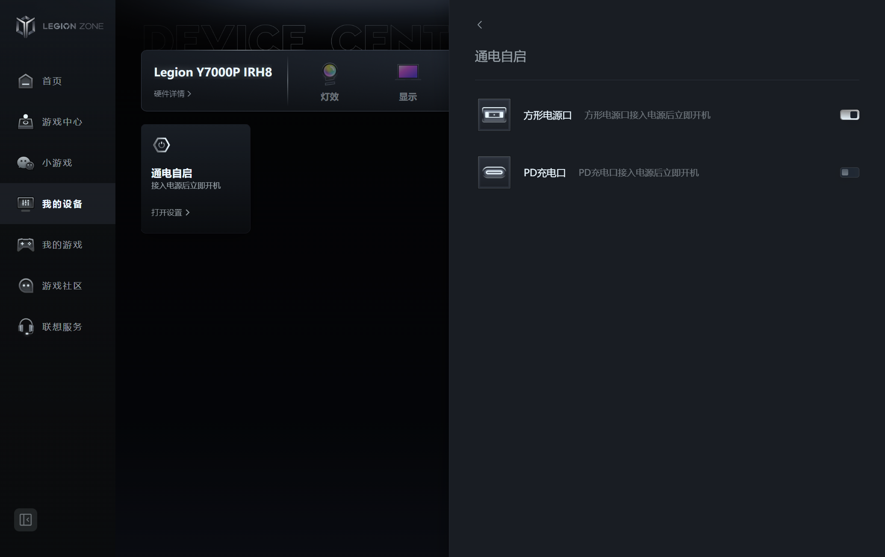

<!-- markdownlint-disable MD033 MD007 MD029 MD060 -->

# 定时开机

## Windows：定时开机

### 方法 1：BIOS 设置 RTC

在 BIOS 中设置 RTC 定时开机

   - 优点：不会被电量限制
   - 缺点：没插电也会开

1. 进入 BIOS 界面

- 每个品牌、型号的按键可能不一样，常见的是开机时连续按 `Delete` 或 `F2`（`F12` 多半是启动设备选择菜单，不一定能进 BIOS），请自行查阅硬件厂商说明

2. 进入 BIOS 界面后，进入 SETTINGS 界面。

3. 找到 Wake Up Event Setup。菜单名以你主板的实际叫法为准，不同品牌差异很大，常见的还有 Resume by RTC Alarm、Power On By RTC 等。

   - RTC（Real-Time Clock）是主板上的独立时钟芯片，即使电脑断电也能保持运行。你可以设置一个未来的时间点，RTC 会在到达该时间时发送信号唤醒主板电源，启动系统。
   - 将 Resume by RTC Alarm 设置为 Enable。

4. 将 Date (of Month) Alarm 设置为 0。

   | 值 | 含义 |
   |---|---|
   | 1-31 | 每月的 1 号到 31 号触发 |
   | 0 或 \* | 每天触发（忽略日期） |
   | 特定值如 15 | 每月 15 号触发 |

   - "Date of Month Alarm"（日期闹钟）是 RTC 闹钟的一个设置选项，表示每月的哪一天触发闹钟，多数固件下设置为 0 就是每天触发（也有固件用 0 表示关闭，请以你主板上的说明为准）。
   - 下方的 time(hh)(mm) 与 (ss) 就表示电脑自动开机的时间。
   - 例如：我希望可以每天 3:45 自动开机，那我就如下设置

     - Time(hh) Alarm：3
     - Time(mm) Alarm：45
     - Time(ss) Alarm：0

5. 改完后按 `F10` 保存退出，重启进入系统即可。

#### 方法 2：用智能插座控制通电间接开机

通过控制通电时间间接控制开机

无广：以下使用的智能插座为拼夕夕买的米家智能插座，软件用的小米手机自带的“米家”

   - 优点：可自由控制时间，更改开关机时间无需进入 BIOS 界面
   - 缺点：要买个可以远控的智能插座（比如小米智能插座）
   - 仅支持笔记本电脑（应该）

1. 准备一个智能插座，然后将电源适配器插在上面，然后自己配对一下智能插座(如何配对软件问你买插座的客服)

2. 开启电脑的通电自启功能
   - 此处用联想的联想盒子示范，不同电脑需自行寻找设置位置

   

3. 在控制软件(这里用的米家)中设置开关机时间

   - 一般建议设置 3:45 自动关机、3:50 自动开机，通电和断电之间间隔时间太短，可能会让电脑觉得自己没断过电，从而导致开机失败

4. 自己测试一下，可以关机电脑后直接控制智能插座关机然后过一分钟控制其开机看看会不会启动电脑，可以的话应该就没问题

### MacOS：定时开机

待补充...

### Linux：定时开机

待补充...

以上方法来源网络，若有误请及时反馈

此页内容参考了

- 若有侵权请联系该页作者删除

[肘击王结城友奈](<https://www.bilibili.com/video/BV1pKwxzwEaP?vd_source=43fdeaf65ea5c12a419d74d955a2ebfd>)

[IT豪哥](<https://www.bilibili.com/video/BV1QY411q7cT?vd_source=43fdeaf65ea5c12a419d74d955a2ebfd>)

写的过程中问了[通义千问和](<https://www.qianwen.com/>)[大肥鲸](<https://www.deepseek.com/>)一些关于部分风险和文档格式的问题

