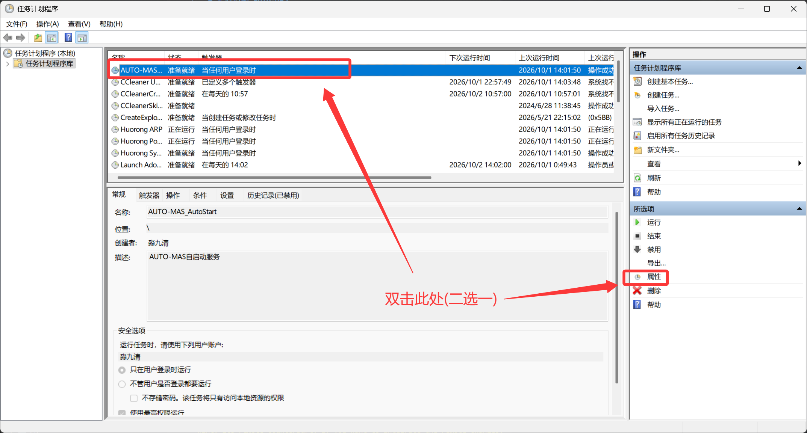
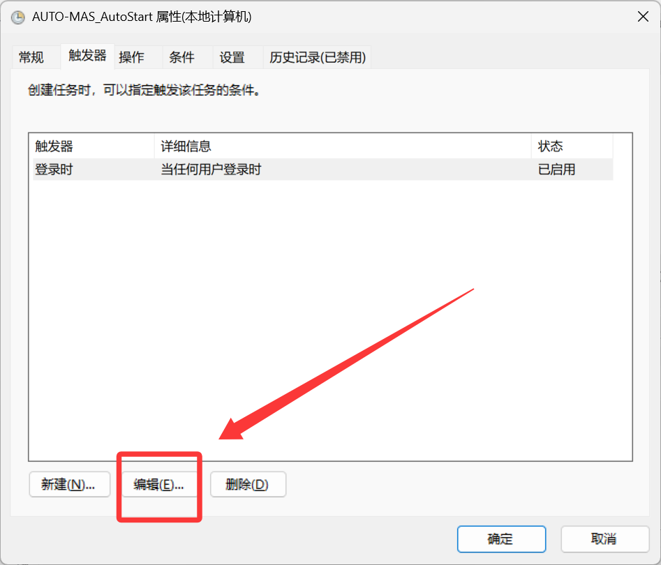
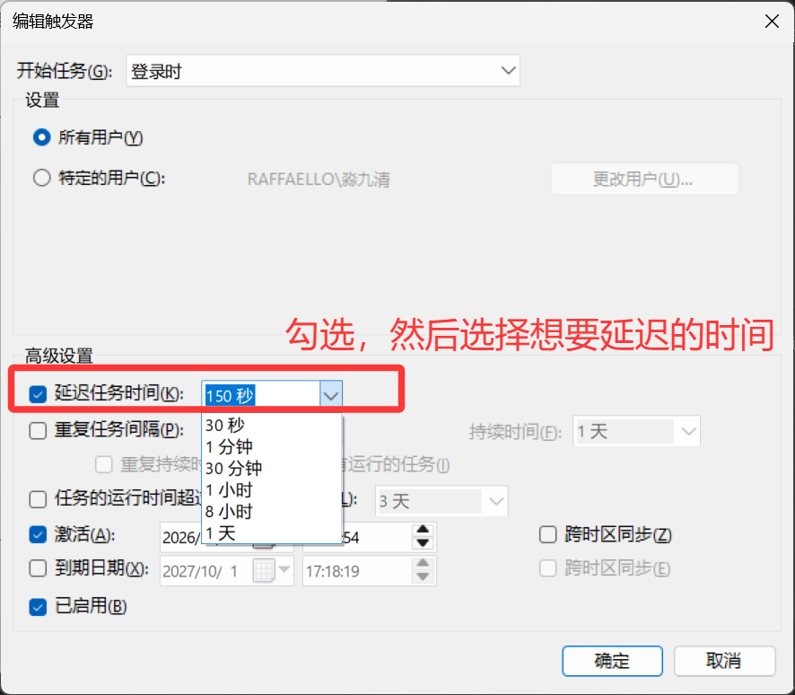

<!-- markdownlint-disable MD033 MD007 MD029 MD060 MD046 -->

# 定时启动 AUTO-MAS

    -暂时只有Windows

电脑永远不关机，希望 AUTO_MAS 自行定时启动的看这篇文章
这篇讲怎么控制 **AUTO-MAS 这个程序本身** 什么时候被拉起来，分两种需求：

- **开机自启时网络还没就绪，一启动就报"运行环境失败（RUNTIME_PIN_UNAVAILABLE）"，点重试才好** → 看下面的「延迟启动」，让它登录后等一会儿再启动。
- **想让 AUTO-MAS 每天固定时间自己启动**（电脑常年开着）→ 看下面的「定时启动」。

> 想让**电脑本身**在完全关机状态下定时开机，Windows 任务计划程序做不到，请看 [定时开机](./Timed-Startup.md)。

---

## 一、延迟启动（登录后等 N 秒再拉起）

### 原理

AUTO-MAS 开启开机自启后，会在系统里注册一个计划任务 `AUTO-MAS_AutoStart`：**你一登录它就立刻启动**。开机瞬间网卡、DNS 都还没就绪，这时候去拉镜像源、拉 Runtime 就会撞上 `getaddrinfo ENOTFOUND`，初始化中止报错。

给这个登录触发器加一个 **Delay（延迟）**，等网络通了再启动，就绕过去了。

### 方法 1：图形界面（只能选固定档位）

1. `Win + R` 输入 `taskschd.msc` 回车(或者按win之后搜索“任务计划程序”)，打开任务计划程序。
2. 在任务列表里找到 **`AUTO-MAS_AutoStart`**，双击打开属性。
   - 若AUTO_MAS不存在，请打开AUTO-MAS的开机自启
   
3. 切到 **触发器** 选项卡 → 选中"登录时" → 点 **编辑**。
   
4. 勾选 **延迟任务时间**，下拉选一个档位（只有 15 秒 / 30 秒 / 1 分钟 / 5 分钟这些预设，没有"2 分半"这种自定义值）。
   
5. 选完之后点击右下角的"确定"保存。

### 方法 2：命令行（管理员，可自定义任意时长）

下拉档位满足不了你的话，用命令行即可自定义时长，格式是 `mmmm:ss`（4 位分钟 : 2 位秒）：

例如希望电脑启动后等待两分半再启动 AUTO-MAS

```bat
:: 管理员终端里运行
schtasks /Change /TN "AUTO-MAS_AutoStart" /DELAY 0002:30
```

| 想延迟 | 命令里写 |
|---|---|
| 30 秒 | `0000:30` |
| 1 分钟 | `0001:00` |
| 2 分 30 秒 | `0002:30` |
| 取消延迟（登录立刻启动） | `0000:00` |

看到下面这样的输出就是成了：

```bat
C:\Users\用户名> schtasks /Change /TN "AUTO-MAS_AutoStart" /DELAY 0002:30
成功: 更改了计划任务 "AUTO-MAS_AutoStart" 的参数。
```

::: warning 注意

- 一定要在 **管理员终端** 里跑（右键开始菜单 → 终端(管理员)）。普通窗口跑会报"拒绝访问"。
- 如果提示"请输入 XXX 的密码"，输的是你 **Windows 账户的登录密码**（不是 PIN 码）。
- 改完可以用这条命令验证，看到 `<Delay>PT2M30S</Delay>` 就是写进去了：

```bat
schtasks /Query /TN "AUTO-MAS_AutoStart" /XML
```

- 图形界面重新打开触发器后，下拉框可能因为识别不了自定义时长而显示空白或默认值，**这是正常现象，以命令行查到的实际值为准**。
:::

---

## 二、定时启动 AUTO-MAS（每天固定时间）

电脑常年不关机，想让 AUTO-MAS 每天比如凌晨 3:45 自己启动，用任务计划程序新建一个任务。

### 方法 1：图形界面

1. `taskschd.msc` → 右侧 **创建任务**（注意不是"创建基本任务"）。
2. **常规** 页：名称填 `AUTO-MAS_TimedStart`，勾选 **使用最高权限运行**。
3. **触发器** 页 → 新建 → 开始任务选"按计划" → 选"每天" → 填上时间（如 03:45）。
4. **操作** 页 → 新建 → 程序或脚本填 `D:\aWa\AUTO-MAS\AUTO-MAS.exe`，添加参数填 `--auto-start`。
5. **条件** 页：想让电脑从睡眠里醒来跑，就勾选 **唤醒计算机运行此任务**。
6. 确定保存。

### 方法 2：命令行（管理员）

```bat
:: 每天 03:45 以最高权限启动 AUTO-MAS（/F 表示同名任务直接覆盖）
schtasks /Create /TN "AUTO-MAS_TimedStart" /TR "\"D:\aWa\AUTO-MAS\AUTO-MAS.exe\" --auto-start" /SC DAILY /ST 03:45 /RL HIGHEST /F
```

改时间或删除任务：

```bat
:: 改成每天 05:00
schtasks /Change /TN "AUTO-MAS_TimedStart" /ST 05:00

:: 不要了直接删
schtasks /Delete /TN "AUTO-MAS_TimedStart" /F
```

::: tip 几个要知道的点

- **完全关机的电脑叫不醒**：定时任务只能在已开机、睡眠或休眠状态下触发。关机状态要靠 BIOS 定时开机，见 [定时开机](./Timed-Startup.md)。
- **AUTO-MAS 内部自带定时队列**：如果你的需求只是"每天某几个点让脚本自动跑"，其实不用建 Windows 计划任务，AUTO-MAS 的调度队列里有现成的 **定时运行**，见 [任务管理](../task-scheduler.md)。
- **延迟启动 + 定时启动可以叠加**：登录延迟解决开机网络抖动，每天定时任务解决"到点自己起来跑日常"，两个任务不冲突。
:::
