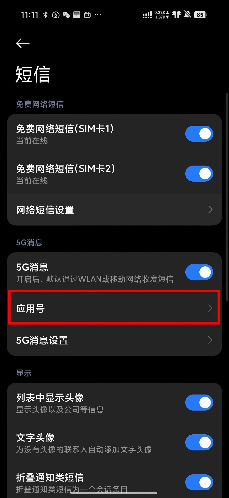
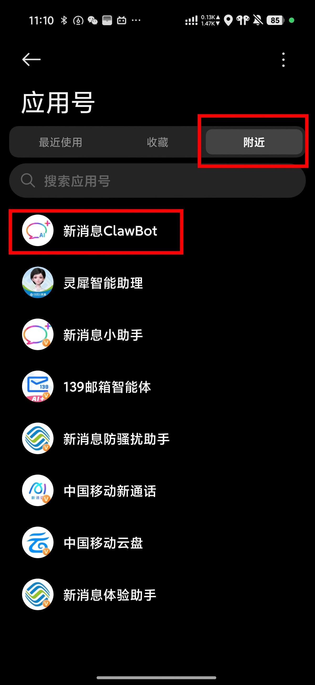
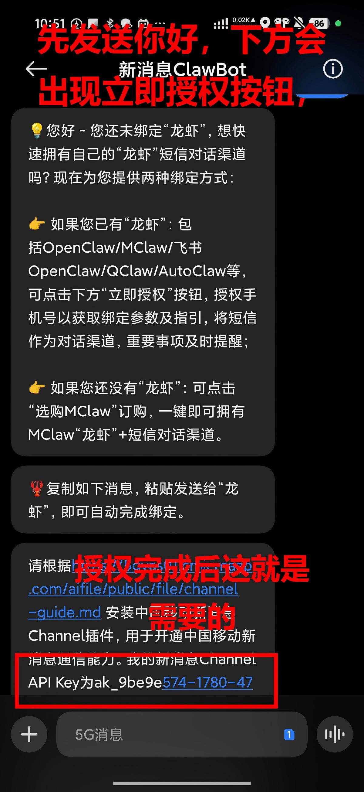

# 中国移动新消息

中国移动新消息是基于 5G 消息（RCS）的通知渠道。配置完成后，AUTO-MAS 可以通过中国移动新消息向手机发送任务结果、运行状态和异常提醒。

## 使用条件

使用中国移动新消息前，请确认以下条件：

1. 当前手机卡为中国移动号码；
2. 手机系统支持 5G 消息；
3. 已开通 5G 消息服务；
4. 已获取有效的 Channel API Key。

## 第一步：获取 Channel API Key

Channel API Key 是连接中国移动新消息服务的凭证，请按照以下步骤获取。

1. 确认当前手机卡为中国移动号码。

2. 打开系统短信设置，进入「应用号」。
   
3. 搜索并打开「新消息ClawBot」应用号。
   
   如果尚未开通 5G 消息，请按照手机页面提示完成开通。

4. 在「新消息ClawBot」应用号中找到并复制 Channel API Key。
   

   合法的 Channel API Key 通常以 `ak_` 或 `app_` 开头。复制时请确保内容完整，不要包含空格、换行或短信中的其他文字。

## 第二步：配置中国移动新消息

获取 Channel API Key 后，在 AUTO-MAS 的通知设置中填写中国移动新消息配置。

1. 打开 AUTO-MAS。

2. 进入「设置」>「通知设置」。

3. 找到「中国移动5G短信通知（免费，仅限中国移动手机号）」配置项并启用该通知渠道。

4. 将上一步复制的 Channel API Key 粘贴到对应输入框中。

::: tip 关于配置范围

中国移动新消息可用于发送全局通知。全局通知适用于所有任务；如果版本提供用户级通知配置，也可以在对应用户的通知设置中单独配置。

:::

## 安全注意事项

- Channel API Key 属于敏感凭证，请勿发布到截图、日志、代码仓库或公开聊天中；
- 复制 Key 时不要在前后附加空格或其他字符；

