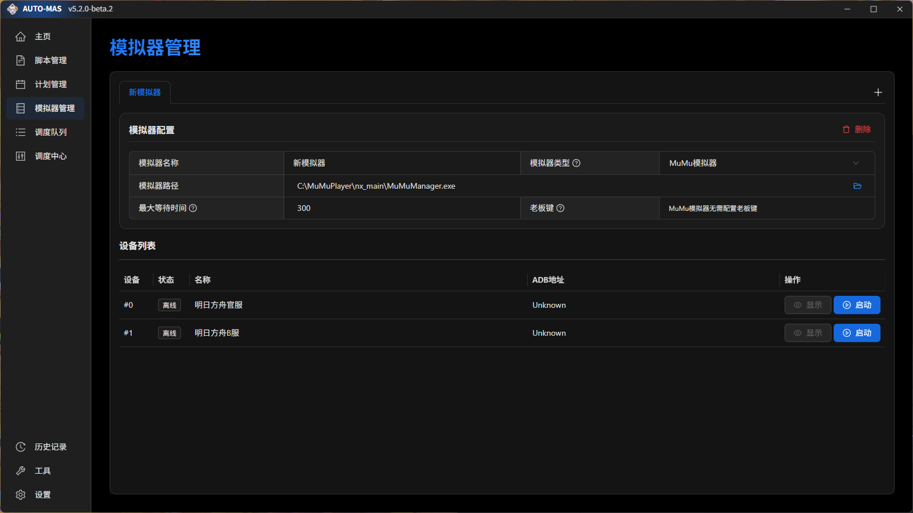

# 模拟器管理

在这里把模拟器登记一次，各个脚本的模拟器相关配置就由 AUTO-MAS 统一填写，不用你一个个脚本手动对。多开、连不上之类的老问题多半就此解决。

说白了它就是个多开器：用命令行问模拟器要到实例信息（端口、实例号等），再自动填进各脚本的配置里。

*图中是示例内容，你需要自己配置*

## 添加模拟器

点自动搜索就行——AUTO-MAS 会扫 **默认安装路径**。

如果你装模拟器时改过安装位置，自动搜索找不到，得手动添加。

## 各项配置怎么填

| 配置项 | 填什么 |
| --- | --- |
| **模拟器名称** | 随便起，只在 AUTO-MAS 里显示给你自己看 |
| **模拟器类型** | 从下拉框选你用的是哪款，如 MuMu / 雷电 |
| **模拟器路径** | 选**多开器**的位置，不是模拟器主程序 |
| **最大等待时间** | 等模拟器启动多久。模拟器起来之后才会启动脚本，机器慢就调大 |
| **老板键** | 静默模式下 AUTO-MAS 会自动按这个键把模拟器藏起来 |

::: tip 常见的多开器路径
- MuMu12 v4：`mumu安装目录\shell\MuMuManager.exe`
- MuMu12 v5：`mumu安装目录\nx_main\MuMuManager.exe`
- 雷电：`雷电安装目录\LDPlayer9\dnplayer.exe`
:::

::: tip 还没装模拟器的话，选 MuMu12 或雷电
这两款性能和截图效果都不错，多开器适配也最完善，AUTO-MAS 对它们的支持最好。用别的模拟器可能会遇到没人踩过的坑。
:::
