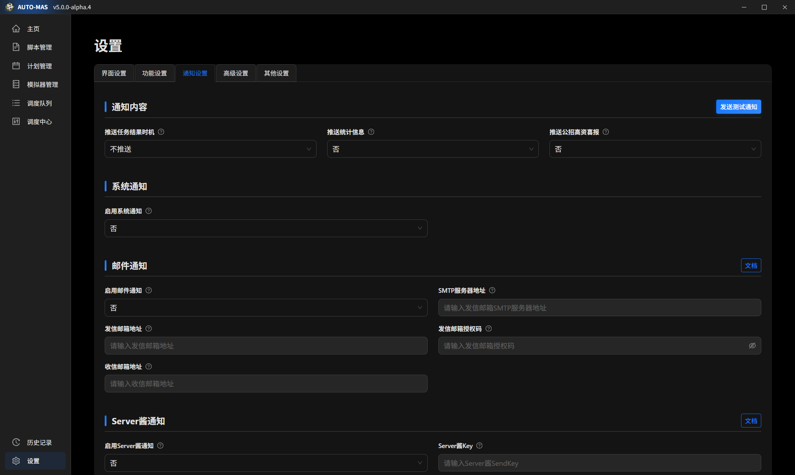
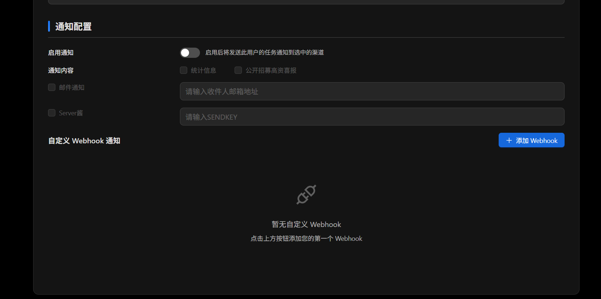

# 通知

代理跑完了、某个号失败了，让 AUTO-MAS 发消息告诉你。支持邮件、Server 酱、企业微信机器人几种渠道。

## 两级通知：全局和用户

**全局通知** 在 **设置 > 通知设置** 里配，管所有任务。一般配这一个就够了。

**用户通知** 在 **用户配置 > 通知设置** 里配，可以给某个号单独指定收件人。典型场景：你帮朋友代肝，想让他自己也收到自己那个号的结果。

::: tip 用户通知是"额外多发一份"，不是"改收件人"
配了用户通知之后，全局通知照样会发给你，然后再额外发一份给这个用户指定的地址。它不会覆盖全局设置。
:::

## 邮件推送

用邮箱收通知需要填三样：**SMTP 服务器地址**、**发信邮箱**、**授权码**。下面分别说怎么拿到。

::: tip **AUTO-MAS 私域邮箱已上线**

1. AUTO-MAS 私域邮箱是什么？

- AUTO-MAS 私域邮箱是基于阿里云企业邮箱的`auto-mas.top`域名邮箱。

2. AUTO-MAS 私域邮箱的优点是？

- 嗯，域名比较特别，看起来专业点？

3. 怎么用 AUTO-MAS 私域邮箱？

- AUTO-MAS 私域邮箱的登录页为 [阿里邮箱企业版](https://qiye.aliyun.com)，SMTP 服务器地址为`smtp.qiye.aliyun.com`，授权码为`登录密码`，其他使用方法与普通邮箱一致。

4. 如何申请 AUTO-MAS 私域邮箱？

- 发送申请邮件到`DLmaster_361@auto-mas.top`，要求邮件中包含：`邮箱名（纯英文）`、`安全手机号`、`申请原因`。邮箱创建成功后，将会返回一封包含`初始密码`的回执邮件。
  :::

### SMTP 服务器地址

按你的发信邮箱是哪家的，照抄一行：

| 邮箱 | SMTP 服务器地址       |
| ------------------- | --------------------- |
| **QQ邮箱**          | smtp.qq.com           |
| **163邮箱**         | smtp.163.com          |
| **Gmail**           | smtp.gmail.com        |
| **Outlook/Hotmail** | smtp-mail.outlook.com |
| **Yahoo Mail**      | smtp.mail.yahoo.com   |

表里没有你的邮箱？去它的帮助中心搜"SMTP 服务器地址"。

### 获取授权码

**授权码不是你的邮箱登录密码**，是邮箱专门发给第三方软件用的一串码，得单独去开。填错这个是配邮件通知最常见的失败原因。

各家的开启位置：

1. **QQ 邮箱**

<Pill name="QQ邮箱官方教程" image="https://res.wx.qq.com/t/webmail/webmail/res/static/images/projects/login/loginpage/qqmail_logo_default_35h.e071fb4.png" link="https://service.mail.qq.com/detail/0/75"/>

  - 登录到您的 [QQ 邮箱账号与安全中心](https://wx.mail.qq.com/account)。
  - 在 **账号与安全 > 安全设置 > SMTP/IMAP服务** 中开启服务并获取授权码。

2. **163 邮箱**

<Pill name="163邮箱官方教程" image="https://help.mail.163.com/style/img/logo-163.png" link="https://help.mail.163.com/faqDetail.do?code=d7a5dc8471cd0c0e8b4b8f4f8e49998b374173cfe9171305fa1ce630d7f67ac2a5feb28b66796d3b"/>

  - 登录到您的 [163 邮箱](https://email.163.com)。
  - 进入 **设置 > POP3/SMTP/IMAP**，找到 **IMAP/SMTP服务** 并点击开启。
  - 在弹窗中点击 **继续开启**，根据指示在手机中发送短信。
  - 弹窗生成 **授权密码**，该密码便为您的授权码。

3. **Gmail**

  - 登录到您的 [Gmail](https://mail.google.com)。
  - 进入 **设置 > 查看所有设置 > 转发和 POP/IMAP > IMAP 访问**，选择 **启用 IMAP**。
  - 进入 **用户 > 管理您的 Google 账号 > 安全性 > 两步验证**，按提示开启 **两步验证**。
  - 进入 **两步验证 > 应用专用密码**，按提示创建 **应用专用密码**，该密码便为您的授权码。

4. **Outlook/Hotmail**

  - 登录到您的 **Outlook 账户**。
  - 进入 **我的账户 > 安全和隐私 > 更多安全选项**。
  - 在 **应用程序密码** 中创建应用程序密码。

5. **Yahoo Mail**

  - 登录到您的 **Yahoo 账户**。
  - 前往账户的 **安全设置**。
  - 找到 **生成应用程序密码** 或类似选项以创建应用密码。

::: tip 只有一个邮箱也能用
发信和收信可以填同一个地址，自己发给自己，完全没问题。
:::

::: warning 关于授权码
- 别告给别人，定期换一次。
- 有些邮箱的授权码**只显示一次**，拿到就存好；有些有有效期，到期了通知就发不出去，记得换。
- 授权码在本地是加密存的（和你的 Windows 账号绑定），所以**换电脑或重装系统后，需要重新填一次**。
:::

## Server 酱推送（发到手机）

**Server 酱**（ServerChan）是个把消息转发到手机的中转服务。你在 AUTO-MAS 里填一个它给的 Key，代理结果就会推到你手机上。

<Box :items="[
{ name: 'Server酱Turbo版', link: 'https://sct.ftqq.com/', image: 'https://the7.ft07.com/sct/images/favicon.png' },
{ name: 'Server酱³', link: 'https://sc3.ft07.com/', image: 'https://the7.ft07.com/sct/images/favicon.png' },
]"/>

::: warning 它有两个版本，别搞混
Server 酱在 2024 年出了新版，和老版是两套东西：

- **SCT** = Server酱·Turbo 版（老版），支持微信、钉钉、飞书等多种渠道
- **SC3** = Server酱³（新版），**只支持它自己的 App 推送**

下面的配置项，有些只对其中一个版本有效，看清楚再填。
:::

### SendKey（必填）

SendKey 就是 Server 酱认你这个人的凭据，填了它消息才知道往哪推。按你用的版本去对应页面拿，**两个平台选一个就行**：

- SCT 用户：<Pill name="SCT SendKey" image="https://the7.ft07.com/sct/images/favicon.png" link="https://sct.ftqq.com/sendkey"/>
- SC3 用户：<Pill name="SC3 SendKey" image="https://the7.ft07.com/sct/images/favicon.png" link="https://sc3.ft07.com/sendkey"/>

### 渠道代码（只有 SCT 需要填）

想让消息推到微信、钉钉这些地方，填对应的数字代码。**SC3 用户跳过这项**，它只有 App 推送。

| 渠道              | 代码 |
| ----------------- | ---- |
| 官方 Android 版·β | 98   |
| 企业微信应用消息  | 66   |
| 企业微信群机器人  | 1    |
| 钉钉群机器人      | 2    |
| 飞书群机器人      | 3    |
| Bark iOS          | 8    |
| 测试号            | 0    |
| 自定义            | 88   |
| PushDeer          | 18   |
| 方糖服务号        | 9    |

::: tip 填多个渠道时，中间不要加空格
- ✔️ `1|0|9`
- ❌ `1 | 0 | 9`

格式错了不会报错，但会静默走默认渠道，你可能以为设置生效了其实没有。
:::

### Tag（只有 SC3 需要填）

给推送消息打标签，方便在 App 里分类。**SCT 用户跳过这项**。

::: tip 同样不要加空格
- ✔️ `AUTO-MAS|代理情况`
- ❌ `AUTO-MAS | 代理情况`

留空或填错就是不带标签，不影响推送本身。
:::

## 企业微信机器人推送（发到微信）

::: info 配一次就好，之后直接在微信里收消息
虽然要注册企业微信，但只是为了拿一个机器人地址，之后消息会直接进你的微信。
:::

1. **注册企业账号**：打开 <Pill name="企业微信官网" link="https://work.weixin.qq.com/" image="https://open.work.weixin.qq.com/favicon.ico" />，按指引注册，然后用绑定的微信号登录企业微信客户端。

2. **建一个群，加机器人**：进群聊 → 右上角 **···** → **添加群机器人**。名字头像随便填。手机端电脑端都能操作。

3. **拿 Webhook 地址**：
   - 电脑端：在群里右键机器人 → **查看资料**。
   - 手机端：群聊 → 右上角 **···** → **群机器人** → 点进那个机器人。

4. **填进 AUTO-MAS**：把 Webhook 地址粘贴到 **推送企业微信机器人通知** 里，完成。