<!-- markdownlint-disable MD033 MD007 MD029 MD060 -->
# 跳过开机输入密码与锁屏界面

> 本篇目前只覆盖 Windows，MacOS / Linux 的方案待补充。

设置前记得开启 AUTO-MAS 的开机自启功能，也记得给队列设置定时启动。

因开启这些功能导致的问题概不负责（如半夜电脑被舍友打开做 PPT 删论文等），关闭密码请自行承担风险。

::: warning 密码会以明文形式保存在系统里

Autologon 会把你的登录密码写入注册表 `HKLM\SOFTWARE\Microsoft\Windows NT\CurrentVersion\Winlogon` 的 `DefaultPassword` 项，**以明文保存**。任何能接触到这台电脑的人都能读到它，微软官方也建议改用 LSA secret 方案保存。

请只在自己独占、且物理访问可信的机器上这样设置。

:::

## 跳过密码输入界面

### Windows：跳过密码输入

#### 方法 1：Autologon（推荐）

<details>
<summary>使用 Autologon</summary>

1. 下载 Autologon

   - [点击进入 Autologon 下载网页](https://learn.microsoft.com/zh-cn/sysinternals/downloads/autologon)

   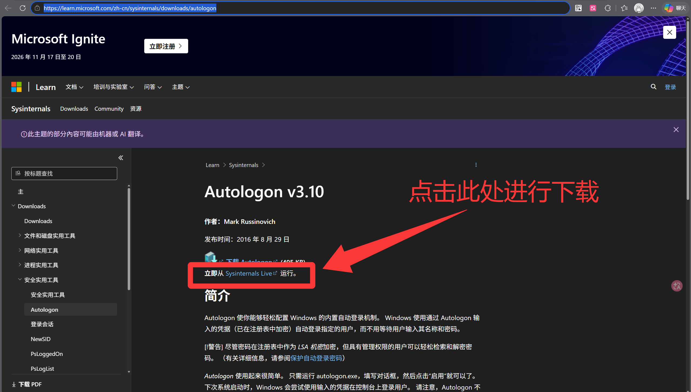

2. 下载完成后，双击运行 autologon.exe。

   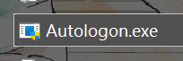

3. 在第三行 Password 输入你的密码。第一、第二行一般会自动读取你的账户名与设备名，不用手动填写。

   是本地账户就输本地账户的密码，是微软账户就输微软账户的密码。

   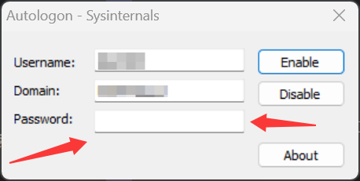

4. 点击 Enable。

   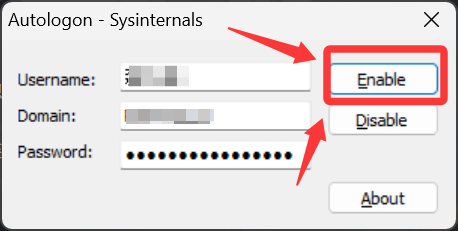

5. 实际测试。

   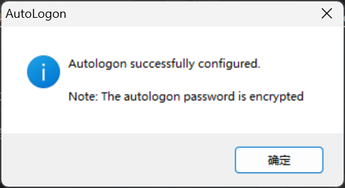

   若出现的是上方所示的弹窗，那便表示设置成功，快去重启试试看吧

<details>

<summary>坏结局</summary>

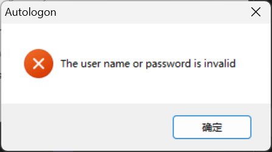

密码输入错误。如果你尝试的是微软账户的密码，那就换成输入本地账户密码，反之亦然。

</details>

<details>

<summary>如何关闭/禁用 Autologon</summary>

1. 打开 Autologon.exe，点一下 Disable 就好了

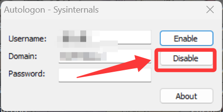

</details>

</details>

#### 方法 2：Windows 自带设置，无需额外下载软件

<details>

<summary>使用 Windows 自带系统设置，无需额外下载软件</summary>

1. 打开系统设置(win+i)

2. 点击进入"账户"-"登录选项"

   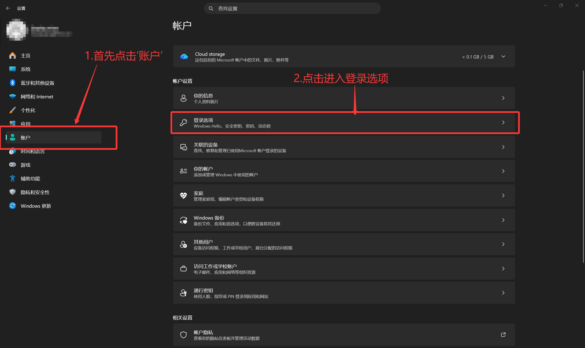

3. 关闭"其他设置"中的图示选项

   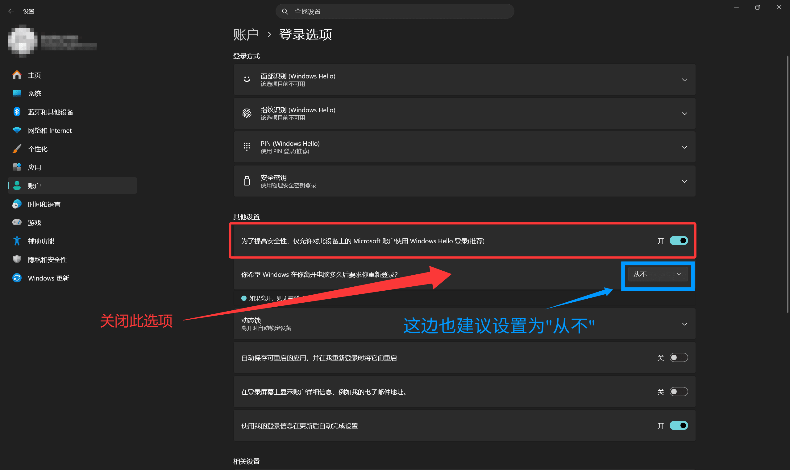

4. 按 Win + R 启动命令框，随后输入 netplwiz，以进入用户账户

```cmd
netplwiz
```

5. 将“要使用本计算机，用户必须输入用户名和密码(E)”关闭

   - 关闭后点击“应用”-“确定”

   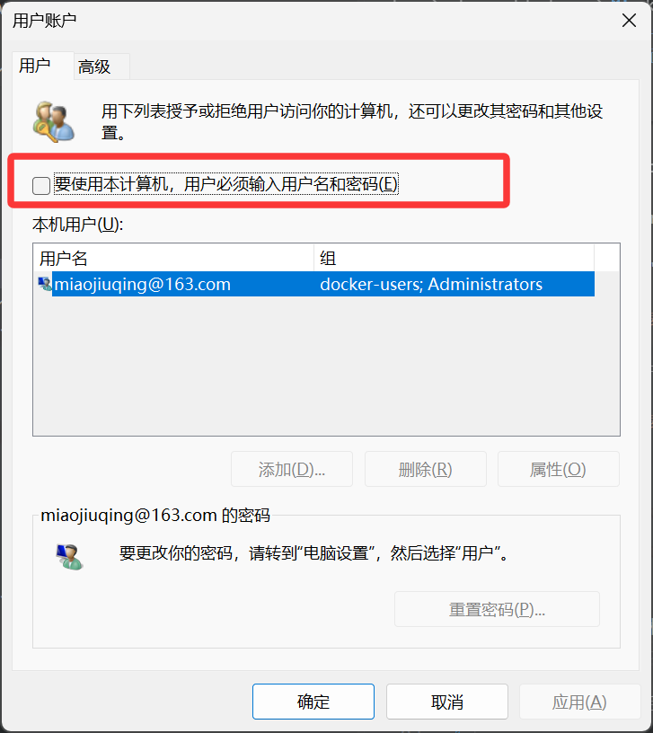

6. 重启试试

7. 如何关闭/禁用

   反着做一遍即可：先用命令行打开“用户账户”，再去设置里勾选“为了提高安全性，仅允许对此设备上的 Microsoft 账户使用 Windows Hello 登录（推荐）”即可

</details>

#### 方法 3：创建无密码的本地账户使用

<details>

<summary>将在线账户更改为本地没密码的账户</summary>

1. 打开设置-账户-账户信息/你的信息

   - 点击之后点击“下一页”，然后输入密码验证一下身份

   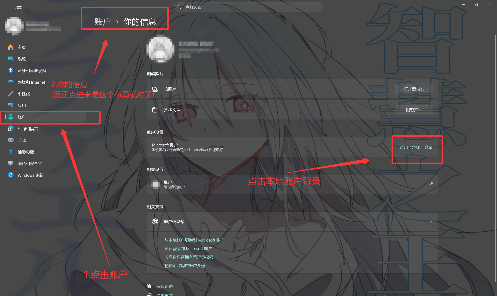

2. 设置本地账户的账户名

   <p style="color: red; font-size: 3em;"><b>⚠ 密码留空！！！</b></p>

   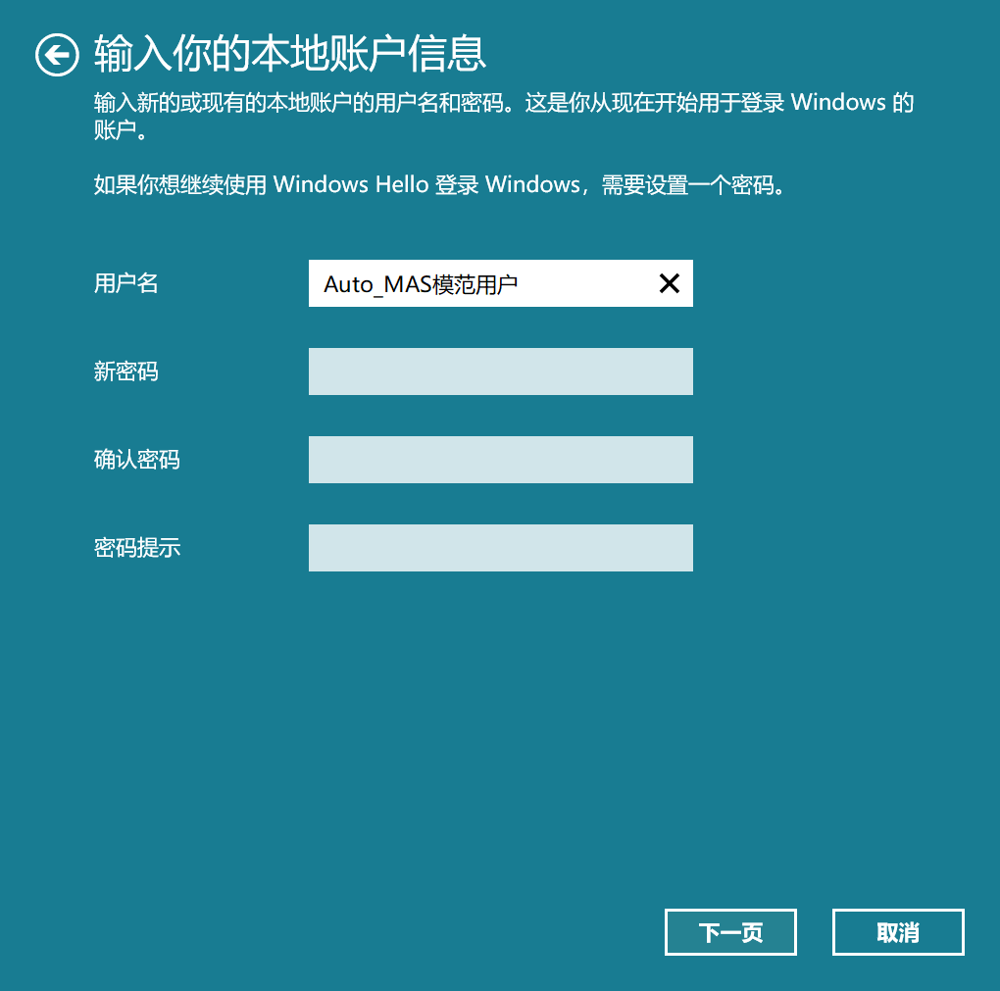

3. 点击“下一页”---->“注销并完成”
   - 此处的“注销”只是结束当前登录会话,相当于把你从当前的微软账户会话里踢出来好用本地账户重新登录回去，不会删东西

4. 等待注销完成后退出重启电脑即可

5. 如何关闭/禁用

   - 大概重新登录一下在线账户就行了吧，大概(视频没讲)

</details>

### MacOS：跳过密码输入

待补充...

### Linux：跳过密码输入

待补充...

## 定时开机

### Windows：定时开机

#### 方法 1：BIOS 设置 RTC

<details>

<summary>在 BIOS 中设置 RTC 定时开机</summary>

   - 优点：不会被电量限制
   - 缺点：没插电也会开

1. 进入 BIOS 界面

- 每个品牌、型号的按键可能不一样，常见的是开机时连续按 `Delete` 或 `F2`（`F12` 多半是启动设备选择菜单，不一定能进 BIOS），请自行查阅硬件厂商说明

2. 进入 BIOS 界面后，进入 SETTINGS 界面。

3. 找到 Wake Up Event Setup。菜单名以你主板的实际叫法为准，不同品牌差异很大，常见的还有 Resume by RTC Alarm、Power On By RTC 等。

   - RTC（Real-Time Clock）是主板上的独立时钟芯片，即使电脑断电也能保持运行。你可以设置一个未来的时间点，RTC 会在到达该时间时发送信号唤醒主板电源，启动系统。
   - 将 Resume by RTC Alarm 设置为 Enable。

4. 将 Date (of Month) Alarm 设置为 0。

   | 值 | 含义 |
   |---|---|
   | 1-31 | 每月的 1 号到 31 号触发 |
   | 0 或 \* | 每天触发（忽略日期） |
   | 特定值如 15 | 每月 15 号触发 |

   - "Date of Month Alarm"（日期闹钟）是 RTC 闹钟的一个设置选项，表示每月的哪一天触发闹钟，多数固件下设置为 0 就是每天触发（也有固件用 0 表示关闭，请以你主板上的说明为准）。
   - 下方的 time(hh)(mm) 与 (ss) 就表示电脑自动开机的时间。
   - 例如：我希望可以每天 3:45 自动开机，那我就如下设置

     - Time(hh) Alarm：3
     - Time(mm) Alarm：45
     - Time(ss) Alarm：0

5. 改完后按 `F10` 保存退出，重启进入系统即可。

</details>

#### 方法 2：用智能插座控制通电间接开机

<details>

<summary>通过控制通电时间间接控制开机</summary>

无广：以下使用的智能插座为拼夕夕买的米家智能插座，软件用的小米手机自带的“米家”

   - 优点：可自由控制时间，更改开关机时间无需进入 BIOS 界面
   - 缺点：要买个可以远控的智能插座（比如小米智能插座）
   - 仅支持笔记本电脑（应该）

1. 准备一个智能插座，然后将电源适配器插在上面，然后自己配对一下智能插座(如何配对软件问你买插座的客服)

2. 开启电脑的通电自启功能
   - 此处用联想的联想盒子示范，不同电脑需自行寻找设置位置

   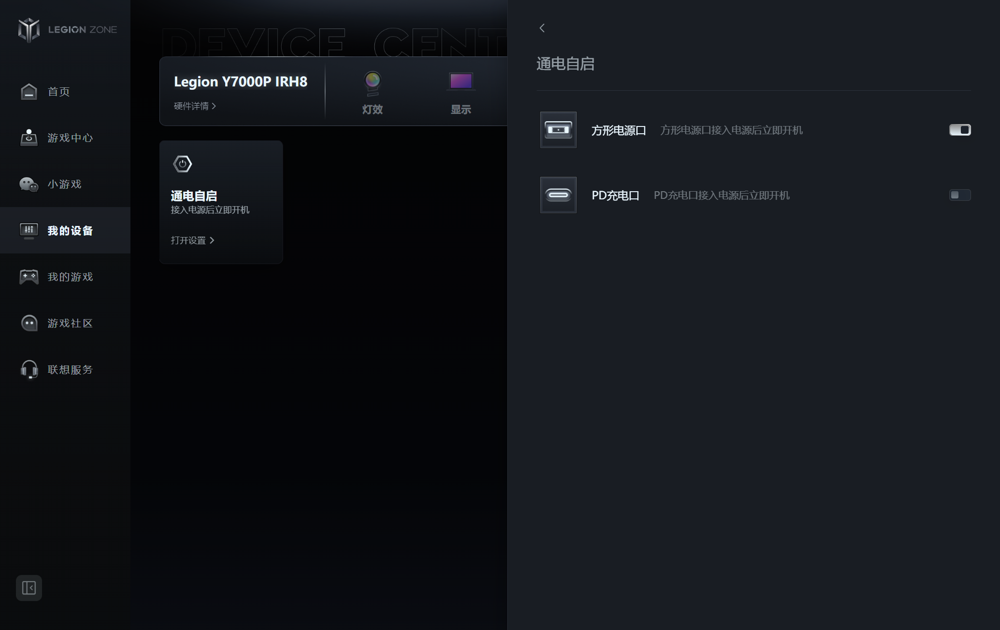

3. 在控制软件(这里用的米家)中设置开关机时间

   - 一般建议设置 3:45 自动关机、3:50 自动开机，通电和断电之间间隔时间太短，可能会让电脑觉得自己没断过电，从而导致开机失败

4. 自己测试一下，可以关机电脑后直接控制智能插座关机然后过一分钟控制其开机看看会不会启动电脑，可以的话应该就没问题

</details>

### MacOS：定时开机

待补充...

### Linux：定时开机

待补充...

以上方法来源网络，若有误请及时反馈

<details>

<summary>此页内容参考了</summary>

- 若有侵权请联系该页作者删除

[肘击王结城友奈](<https://www.bilibili.com/video/BV1pKwxzwEaP?vd_source=43fdeaf65ea5c12a419d74d955a2ebfd>)

[IT豪哥](<https://www.bilibili.com/video/BV1QY411q7cT?vd_source=43fdeaf65ea5c12a419d74d955a2ebfd>)

[通义千问](<https://qianwen.my.cn/share/chat/e6e9752e2ba74705b6d85e3d7d46f629>)

</details>
