<!-- markdownlint-disable MD033 MD007 MD029 MD060 -->
# 开机后跳过锁屏和输入密码界面界面直达桌面

> 本篇目前只覆盖 Windows，MacOS / Linux 的方案待补充。

设置前记得开启 AUTO-MAS 的开机自启功能，也记得给队列设置定时启动。

因开启这些功能导致的问题概不负责（如半夜电脑被舍友打开做 PPT 删论文等），关闭密码请自行承担风险。

::: warning 密码会以明文形式保存在系统里

Autologon 会把你的登录密码写入注册表 `HKLM\SOFTWARE\Microsoft\Windows NT\CurrentVersion\Winlogon` 的 `DefaultPassword` 项，**以明文保存**。任何能接触到这台电脑的人都能读到它，微软官方也建议改用 LSA secret 方案保存。

请只在自己独占、且物理访问可信的机器上这样设置。

:::

## Windows：跳过密码输入

### 方法 1：Autologon（推荐）

<details>
<summary>使用 Autologon</summary>

1. 下载 Autologon

   - [点击进入 Autologon 下载网页](https://learn.microsoft.com/zh-cn/sysinternals/downloads/autologon)

   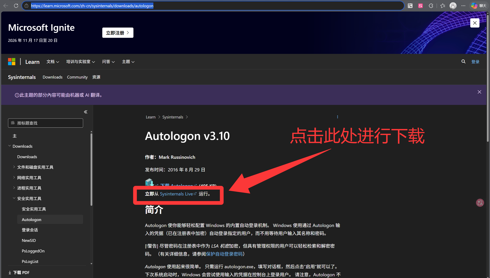

2. 下载完成后，双击运行 autologon.exe。

   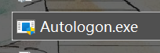

3. 在第三行 Password 输入你的密码。第一、第二行一般会自动读取你的账户名与设备名，不用手动填写。

   是本地账户就输本地账户的密码，是微软账户就输微软账户的密码。

   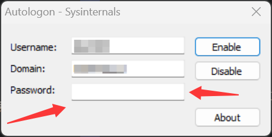

4. 点击 Enable。

   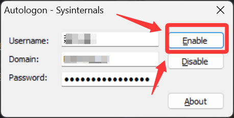

5. 实际测试。

   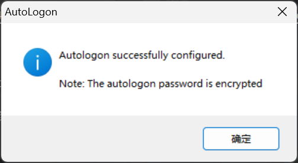

   若出现的是上方所示的弹窗，那便表示设置成功，快去重启试试看吧

<details>

<summary>坏结局</summary>

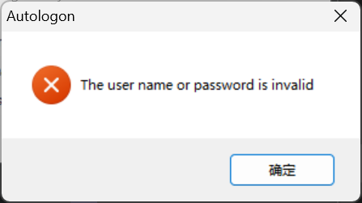

密码输入错误。如果你尝试的是微软账户的密码，那就换成输入本地账户密码，反之亦然。

</details>

<details>

<summary>如何关闭/禁用 Autologon</summary>

1. 打开 Autologon.exe，点一下 Disable 就好了

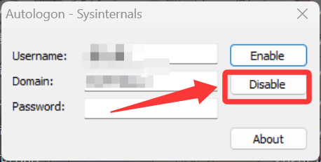

</details>

</details>

#### 方法 2：Windows 自带设置，无需额外下载软件

<details>

<summary>使用 Windows 自带系统设置，无需额外下载软件</summary>

1. 打开系统设置(win+i)

2. 点击进入"账户"-"登录选项"

   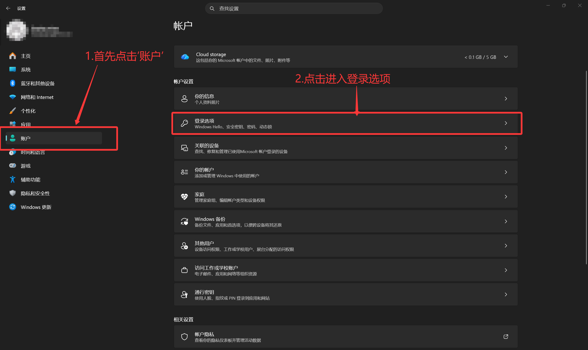

3. 关闭"其他设置"中的图示选项

   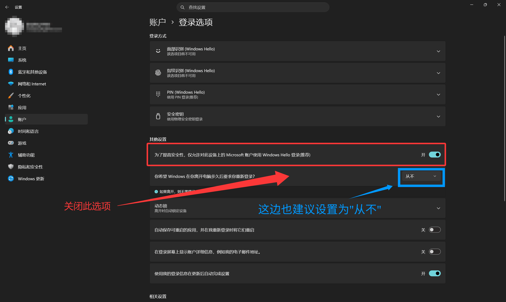

4. 按 Win + R 启动命令框，随后输入 netplwiz，以进入用户账户

```cmd
netplwiz
```

5. 将“要使用本计算机，用户必须输入用户名和密码(E)”关闭

   - 关闭后点击“应用”-“确定”

   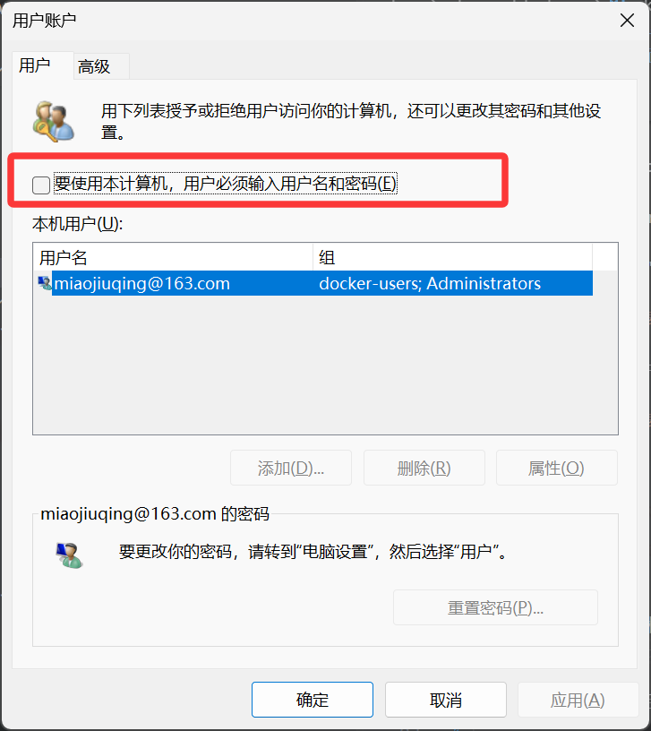

6. 重启试试

7. 如何关闭/禁用

   反着做一遍即可：先用命令行打开“用户账户”，再去设置里勾选“为了提高安全性，仅允许对此设备上的 Microsoft 账户使用 Windows Hello 登录（推荐）”即可

</details>

#### 方法 3：创建无密码的本地账户使用

<details>

<summary>将在线账户更改为本地没密码的账户</summary>

1. 打开设置-账户-账户信息/你的信息

   - 点击之后点击“下一页”，然后输入密码验证一下身份

   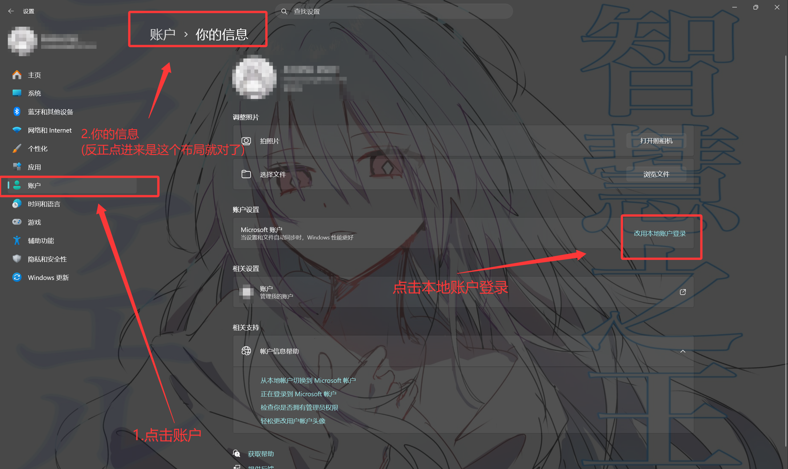

2. 设置本地账户的账户名

   <p style="color: red; font-size: 3em;"><b>⚠ 密码留空！！！</b></p>

   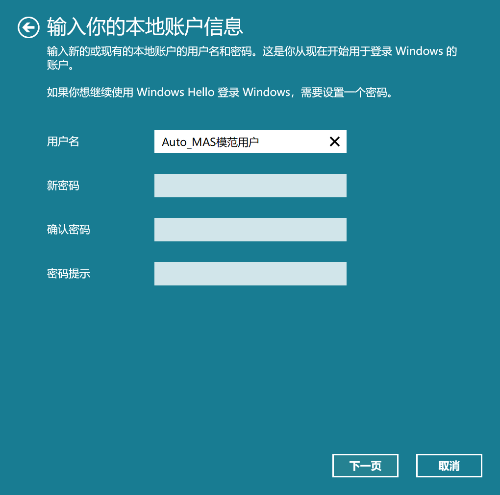

3. 点击“下一页”---->“注销并完成”
   - 此处的“注销”只是结束当前登录会话,相当于把你从当前的微软账户会话里踢出来好用本地账户重新登录回去，不会删东西

4. 等待注销完成后退出重启电脑即可

5. 如何关闭/禁用

   - 大概重新登录一下在线账户就行了吧，大概(视频没讲)

</details>

### MacOS：跳过密码输入

待补充...

### Linux：跳过密码输入

待补充...
