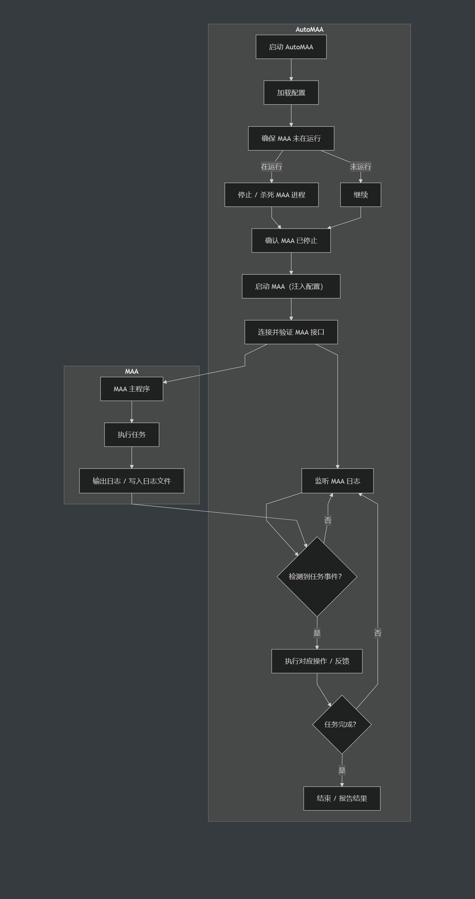

# 通用调度

::: tip 先看这里：大多数人不需要从零配
AUTO-MAS 自带一批现成模板。**新建通用脚本 > 从模板创建**，选好模板，填一个脚本路径就能用。

三月七、SRC、zzzOD、M9A 等常见脚本都有成熟模板，先去看看有没有你要的。
:::

::: warning 从零手配需要你了解那个脚本
如果模板里没有你的脚本，就得自己填监看规则——这需要你知道那个脚本的日志长什么样、怎么启动。不熟的话，建议先找别人分享的配置导入。

另外，通用调度的稳定性通常不如专门适配过的脚本，这是机制决定的，别怪分享配置的人~
:::

## 它是怎么工作的

看懂这两条，后面出问题你自己就能查。

### 配置怎么管的：借走、还回

AUTO-MAS 不解析脚本的配置格式，而是**整份保管**：任务开始前，把你保存的那份配置原样复制到脚本目录里；任务结束后，再把脚本原来的配置还回去。

所以每个用户跑的时候都是自己那份配置，且不会污染你在脚本里手动做的设置。

### 成功失败怎么判的：盯日志

AUTO-MAS 看不懂脚本界面，它只盯三样东西：**日志里出现了什么文字**、**日志最后一次更新是几点**、**脚本进程有没有退出**。

判定规则取决于你有没有填 **任务成功日志**：

| 你填了成功日志 | 你留空了成功日志 |
| --- | --- |
| 日志里出现成功关键词 → **成功** | 脚本自己正常退出，且没出现过异常关键词 → **成功** |
| 脚本退出了但没出现过成功关键词 → **失败** | 脚本退出前出现了异常关键词 → **失败** |

另外两条无论如何都生效：

- 异常关键词比成功关键词先出现 → **失败**
- 日志超过 **自动代理超时限制** 没有任何更新 → 判定卡死，**超时失败**

以 MAA 为例：


## 脚本设置

这些设置决定了 AUTO-MAS 用什么方式伺候你的脚本，填得准不准直接决定代理稳不稳。

### 脚本根目录

选脚本所在的**文件夹**。先填这个，其他路径才能填。

以后脚本换了位置，你只要改这一项，下面的路径会跟着自动改，不用一个个重选。

### 脚本路径

选脚本的**主程序 exe**，也就是你平时双击启动它的那个文件。

- **提示"所选路径不在脚本根目录下"**：字面意思，回去检查脚本根目录选对了没。
- **启动不起来**：路径和启动参数二者之一填错了，去 `debug/AUTO-MAS.log` 看具体报错。

### 脚本启动参数

**大部分脚本不用填这一项，先留空试试。**

有些脚本界面里没有"启动后自动开跑"的选项，只能靠命令行参数实现。这类脚本才需要填。

**怎么找**：去脚本的官网或文档站，搜 **命令行**、**CLI** 这类章节，把能让它"启动即运行"的参数抄过来。

如果你的脚本还有下面这两种特殊情况，才需要用到分隔符：

- **配置时和跑任务时参数不一样** → 两组参数用 `|` 隔开，前面是跑任务的，后面是配置用的。
- **配置时和跑任务时用的不是同一个 exe** → 在参数前面写上那个 exe 相对 `脚本路径` 的位置，用 `%` 隔开。

完整格式长这样（用不到的部分不用写）：

```text
{跑任务的exe}%{跑任务的参数}|{配置用的exe}%{配置用的参数}
```

### 追踪脚本子进程

**先保持默认，出问题了再动它。**

有些脚本是"启动器拉起主程序，然后启动器自己退出"。这时候光看启动器进程会误判成脚本已经结束了，需要打开这个开关，连子进程一起盯。

- **脚本关了，AUTO-MAS 还以为在跑** → 关掉本项。
- **脚本还在跑，AUTO-MAS 说它退出了** → 打开本项。

### 脚本配置文件路径

选脚本存配置的文件或文件夹。

**怎么找**：打开脚本目录，找名字带 `config` 的文件或文件夹，通常就是它。

### 脚本日志文件路径

选脚本写日志的那个文件。

**怎么找**：打开脚本目录，先看有没有 `debug`、`log` 之类的文件夹。

- **有这个文件夹**：进去挑一个 `.log` 或 `.txt` 文件。
  - 文件名里**不带日期**（如 `log.txt`、`gui.log`）→ 直接选它，收工。
  - 文件名里**带日期**（如 `2025-06-29.log`）→ 也选它，然后还要填下面的 **日志文件名格式**。
- **没有这个文件夹**：在脚本根目录里找 `.txt`、`.log` 文件，打开确认里面是日志内容，选它。

### 脚本日志文件名格式

**日志文件名里不带日期的，这项留空。**

有些脚本每天新建一个日志文件，文件名带日期，AUTO-MAS 得知道命名规律才能找到今天那份。

**怎么填**：把一个日志文件名复制进来，然后把里面表示日期时间的部分换成符号。比如 `2019-05-01` 写成 `%Y-%m-%d`。符号含义见 [日期时间格式符号表](/docs/advanced-features/#常见日期时间格式符号对照表)。

### 脚本日志时间戳起始/结束位置

告诉 AUTO-MAS 每行日志里的时间戳从第几个字符开始、到第几个结束——它靠这个判断脚本是不是卡住不动了。

**怎么数**：挑一行带时间戳的日志，从 `1` 开始数字符。例如：

```text
[2025-06-29 20:00:35.909][INF] <1><> 开始任务
```

`[` 是第 1 位，时间戳从第 2 位开始，到第 24 位结束。所以起始填 `2`，结束填 `24`。

### 脚本日志时间格式

把上面那段时间戳的写法翻译成符号，AUTO-MAS 才读得懂它是几点。

比如 `2019-05-01 16:00:00.000` 填成 `%Y-%m-%d %H:%M:%S.%f`。符号含义见 [日期时间格式符号表](/docs/advanced-features/#常见日期时间格式符号对照表)。

### 脚本成功/失败日志

填关键词，AUTO-MAS 在日志里看到就判成功或失败。可以填多条，用 `|` 隔开。

**怎么找**：手动跑一次脚本，打开它的日志文件，找到跑完时打的那句话（比如"任务全部完成"），把里面稳定不变的一小段抄进 **成功日志**；同理把报错时的特征句抄进 **失败日志**。

挑词的时候选那种"只在成功时出现"的句子，别挑每次都会打的通用信息，否则会误判。

## 分享和导入配置

好不容易配好一个脚本，可以导出成 JSON 文件分享给别人；别人分享的 JSON 也可以直接导入。想让更多人用上，还能提交到 **AUTO-MAS 配置分享中心**，审核通过后所有用户都能一键导入你的配置。

::: warning 分享前自己检查一遍路径
导出和上传都会自动做一次脱敏，但**只覆盖一部分路径**，剩下的要你自己看。

自动处理的：

- **脚本根目录** 被替换成 `C:/脚本根目录`。所以**导入别人的配置后，第一件事是重新选一次自己的脚本根目录**。
- **脚本路径、配置文件路径、日志文件路径、追踪进程路径** 这四项，如果在脚本根目录底下，会跟着改成相对根目录的写法；如果在 `AppData` 底下（比如 SRA 的配置目录），会被改写成 `%APPDATA%/...`，你的 Windows 用户名不会漏出去。

需要你自己检查的：

- **游戏/模拟器路径不会被脱敏**，原样保留。
- 上面那四项如果既不在脚本根目录、也不在 `AppData` 底下，同样原样保留。

所以分享前打开导出的 JSON 扫一眼，看到 `C:/Users/张三/...` 这种带真实姓名的路径，自己改掉再发。
:::

## 下属用户

一个通用脚本下面可以挂多个用户，每个用户存一份独立的脚本配置，跑任务时轮流换上。用法和 MAA 脚本的用户一样，每个用户都要单独配一次。
