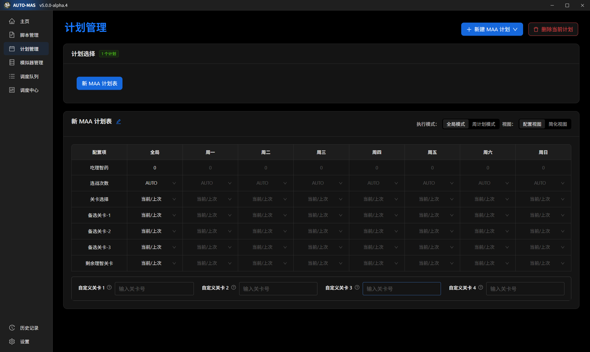
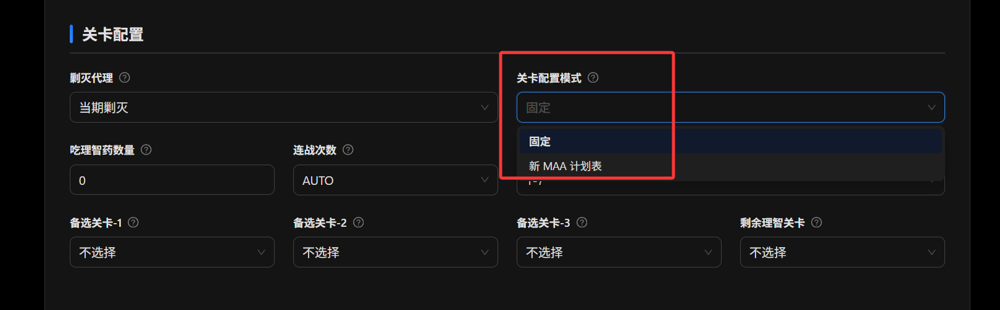

# MAA 配置方法

## 什么是 MAA？

MAA 是一个明日方舟第三方软件，能够轻松完成明日方舟日常代理、肉鸽存钱等重复性无趣工作。

**详情信息请查阅**：

<Box :items="[
{ name: 'MAA 官网', link: 'https://maa.plus/', image: '/icons/maa.ico', },
{ name: 'MAA GitHub', link: 'https://github.com/MaaAssistantArknights/MaaAssistantArknights', image: { light: '/icons/github.svg', dark: '/icons/github-dark.svg', }, },]"/>

## 从零部署 AUTO-MAS（图文）

还没有装 AUTO-MAS 的先看这一节。以下截图来自 v5.5.0-beta.6。

1. 获取安装包并解压，运行其中的 `AUTO-MAS-Setup.exe`，按向导完成安装。


2. 安装完成后保持勾选 **运行 AUTO-MAS**，单击 **完成**。


3. 首次启动会自动配置运行环境：先对镜像测速，再依次完成 **运行环境 → 程序文件 → 依赖 → 启动** 四步，全程无需点击（依赖阶段约 136 MB，耗时最长）。


::: tip v5.4 的向导不一样
v5.4.x 的向导是六步（Python / Pip / Git / 源码拉取 / 依赖安装 / 后端启动），原理相同，同样全程自动。期间防火墙弹出 Python 警告时单击 **允许访问**。
:::

## 安装 MAA

1. 前往 <Pill name="MAA 官网" image="/icons/maa.ico" link="https://maa.plus"/>、<Pill name="MAA 仓库" :image="{ light: '/icons/github.svg', dark: '/icons/github-dark.svg', }" link="https://github.com/MaaAssistantArknights/MaaAssistantArknights/releases/latest"/> 或 <Pill name="Mirror 酱" image="/icons/mirrorchyan.ico" link="https://mirrorchyan.com/zh/projects?rid=MAA&scouce=AUTO-MAS-Web"/> 下载软件压缩包。
2. 将 MAA 压缩包解压至任意文件夹。

::: warning 有两个位置不可以：

- **别放在中文路径下**，容易引发莫名其妙的报错。用 `D:\MAA` 这样的纯英文路径。
- **别放在 AUTO-MAS 根目录里面**。和其他脚本一样，放在里面有被误删的风险。
:::

## 配置脚本

1. 进入 **脚本管理**，单击 **新建脚本** 并选择 **MAA脚本** 以添加脚本实例管理页面。


v5.5.0 的「新建脚本」窗口如下图，除 MAA 外还新增了 **MFW 脚本** 类型（用于接入任意带 interface.json 的 MaaFramework 项目，见 [MaaEnd 教程](/docs/script-guide/maaend)）：


2. 在 **打开的脚本配置** 中的 **MAA路径** 单击 **选择文件夹**，打开 MAA 软件所在目录。


v5.5.0 的脚本配置页如下图（多了 **游戏更新** 等分组，字段基本一致）：


3. 在 **模拟器管理** 中选择模拟器和模拟器实例。
> 如果此处没有模拟器，请先完成 **模拟器管理配置**

v5.5.0 的模拟器管理新增了 **设备列表**（设备序号、在线状态、ADB 地址、启动按钮）：


4. 点击 **配置 MAA** 在 MAA 中配置。


v5.5.0 下打开的 MAA 窗口如下图（图为 v6.18.0-beta.2，连接设置确认 `127.0.0.1:16384`）：


5. 手动取消勾选 **开机自启动MAA**，并完成 ADB 连接相关配置，其余配置可以根据您的喜好设置。

6. 完成配置后，关闭 **MAA**，并在 AUTO-MAS 中点击 **保存配置**。


## 配置用户

1. 在 **脚本管理** 的脚本表格内，单击 **添加用户** 以添加一个用户。

2. 按照设置卡相关提示填写用户信息。


v5.5.0 把 **任务配置** 直接内联到了用户页里，不用再打开 MAA 逐项勾选：


- **第一次启动 MAA：剿灭流程**——绿票商店、剿灭作战（自动判断"本周未完成"）；
- **第二次启动 MAA：日常流程**——活动关卡优先、**库存保持**（可按关卡设目标库存）、**理智作战**（关卡 / 连战次数 / 理智药直接在下拉里选）、**基建换班**、日常任务（自动公招 / 信用收支 / 领取奖励）等。

::: info 剿灭与日常会分别启动两次 MAA
启用剿灭时先单独启动一次 MAA 执行剿灭，结束后再启动一次执行日常流程。
:::

用户页顶部还新增了 **配置管理方式** 三选一：


- **脚本**：脚本级共享配置，所有用户共用；
- **用户**：该用户独立配置，与脚本隔离；
- **直控**：直接使用 MAA 原有配置，由 MAA 界面维护。


::: info 注意
**用户** 配置模式下不要忘了 **设置具体配置**。
:::
::: tip 账号 ID 小贴士

由于 MAA 在 **B服账号切换** 功能中使用的 OCR（文字识别）技术准确率有限，我们建议如下填写方式以提高识别和切换成功率：

#### 通用建议

- MAA 的账号切换功能只需**成功识别一个唯一片段**即可完成切换。
- 请填写**仅该账号独有的部分片段**，避免与其他账号重复。
- 建议在 MAA 中测试填写片段能否正常切换账号，确认无误后再填写至 AUTO_MAS。
- 若同区服仅有一个账号，也可将 `账号ID` 留空。

#### 官服

- 官服账号ID为手机号，通常只需填写**后四位数字**即可，无需填写完整手机号。~~（你也不想无意中泄露自己的手机号吧~）~~ 
- 示例：
  - 账号1：`133XXXX1234`
  - 账号2：`133XXXX5678`
  - 若要切换账号1，可填写 `2`、`4`、`12`、`34`、`123`、`234`、`1234` 等仅账号1拥有的片段。

#### B服

- B服账号为 B站昵称，可能包含**中文、英文、数字、特殊符号、日文**等复杂字符，OCR 模型识别准确率偏低。因此，**不建议填写完整昵称**，建议填写 **不易识别错误的、唯一片段**，避免：
  - 生僻字（如：`黍`，可能被识别为其他文字）
  - 下划线 `_`（常被识别错误或漏识）
- 示例：
  - 账号1：`DLmaster_361` → 可填写 `master`、`361`
  - 账号2：`黍的XX_1234` → 可填写 `1234`、`的`、`XX`，**不建议填写“黍”或下划线**

经过这些修改，你应该能够稳定的进行账号切换
:::

### 哪些 MAA 设置会被 AUTO-MAS 接管

跑自动代理时，有些 MAA 设置由 AUTO-MAS 接管，你在 MAA 里怎么设都会被覆盖。知道这一点能省掉很多"我明明设过了"的困惑：

- **用户配置页里出现的选项，一律以用户页为准。**
- **剿灭任务**：只开 **开始唤醒** 和 **刷理智**，且只刷剿灭关卡，具体配置由程序按你的用户设置自动生成。
- **日常任务**：跑你在 **任务配置** 里勾选的任务，**顺序是固定的，改不了**。
- **定时执行** 会被强制关掉（定时交给 AUTO-MAS 的调度队列管）。任务完成后行为、启动后行为、最小化、更新这几类设置也会被自动调整。

没被接管的设置，取决于你用哪种配置模式：**脚本** 模式沿用 MAA 的全局设置，**用户** 模式沿用该用户自己的具体配置。

::: tip 同类型任务只有第一个生效
如果你在 MAA 里排了两个同类型的任务（比如两个"刷理智"），只有第一个会被 AUTO-MAS 采用。一个都没有时用默认值。
:::

## 计划表：周一到周日刷不同的关

想周中刷经验、周末刷钱？用计划表按周排关卡。



1. 把配置模式切成 **周计划模式**，然后填每天刷什么。嫌表格太占地方，可以切 **简化视图**，编辑体验类似 mower。
2. 回到 MAA 用户界面，在 **关卡配置模式** 里选中你的计划表。



## 森空岛自动签到

::: warning 注意
AUTO-MAS 在本地处理签到请求，不会将 Token 上传至第三方服务器。

自动签到有一定风险，AUTO-MAS 不对自动签到所造成的任何结果负责。使用此功能代表您同意自行承担相关风险。
:::

### 获取鹰角网络通行证登录凭证

1. 登录[森空岛网页端](https://www.skland.com/)。

2. 访问此[网址](https://web-api.skland.com/account/info/hg)。

   返回如下信息

   ```json
   {
     "code": 0,
     "data": {
       "content": "<Token>"
     },
     "msg": "接口会返回您的鹰角网络通行证账号的登录凭证，此凭证可以用于鹰角网络账号系统校验您登录的有效性。泄露登录凭证属于极度危险操作，为了您的账号安全，请勿将此凭证以任何形式告知他人！"
   }
   ```

3. 将 `<Token>` 输入到软件对应选项卡中。

4. 若您需要连续获取多个账号的 **鹰角网络通行证登录凭证**，请通过 **清理浏览器 cookie** 清除登录状态。直接在网页端退出登录将导致 Token 过期失效。

::: tip 提醒
注意不要把包裹 `content` 内容的引号，或是页面返回的整个内容输入到选项卡中！
:::

森空岛签到只是 AUTO-MAS 社区功能的一部分。米游社、库街区、塔吉多的凭据也在同一处配置，详见 [游戏社区](/docs/advanced-features/community)。

## 放进调度队列

脚本和用户都配好之后，把用户拖进 [调度队列](/docs/task-scheduler) 就能定时自动跑。多个账号按顺序排队，一个跑完自动切下一个。

v5.5.0 的调度队列新增了 **队列类型**（定时队列）与 **延时执行**（到点后再延迟 N 分钟启动）：


需要开机就跑、或者跳过锁屏密码的话，看 [让电脑定时上班](/docs/advanced-features/skip-password)。

## 完整部署实录下载

本文对应的完整图文实录（从获取安装包到运行验证）也提供离线版本：

- v5.5 实录：[PDF](/video-tutorial/maa-v55.pdf) ｜ [HTML](/video-tutorial/maa-v55.html)
- v5.4 实录：[PDF](/video-tutorial/maa.pdf) ｜ [HTML](/video-tutorial/maa.html)

## 常见问题

### 模拟器连不上

先去 **模拟器管理** 把模拟器配好，再回到脚本配置里选模拟器实例。这部分见 [模拟器管理](/docs/advanced-features/emulator)。

### 账号没切换

先按上面的 [账号 ID 小贴士](#账号-id-小贴士) 检查填的片段是不是该账号独有的。官服填手机号后四位通常就够，B服别填完整昵称，容易识别错。

### MAA 里的设置不生效

先看是不是被 AUTO-MAS 接管了：用户配置页里出现的选项一律以 AUTO-MAS 的用户页为准，剿灭、日常任务顺序、定时执行这些也由 AUTO-MAS 控制。详见 [哪些 MAA 设置会被 AUTO-MAS 接管](#哪些-maa-设置会被-auto-mas-接管)。

### 提示路径找不到 / 唤不起 MAA

确认 **MAA路径** 选的是 MAA 的解压目录，路径里没有中文，且 MAA 没有被移动过位置。重新选一次目录让配置刷新。