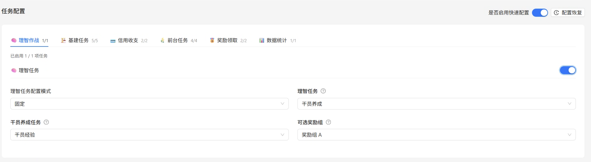
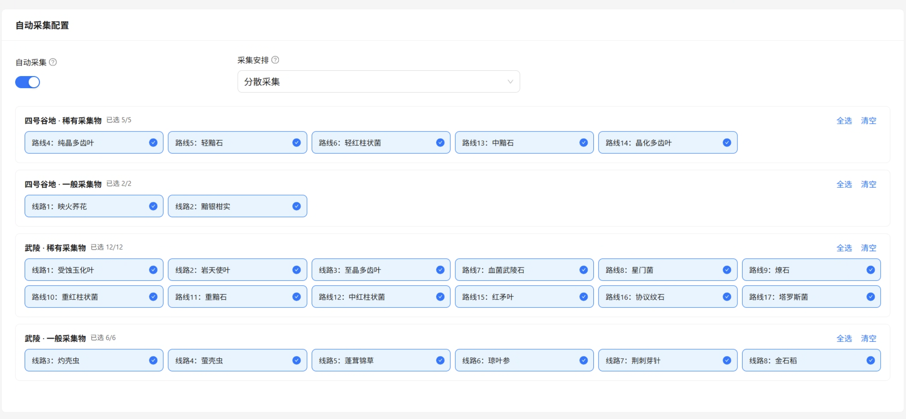
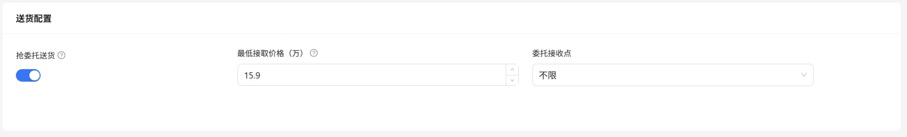

# MaaEnd 配置方法

## TL;DR(太长不看)

下载MaaEnd，新建并配置MaaEnd脚本，选择配置文件来源，（非直控）点击`配置MaaEnd`，编辑详细设置，加入队列，开始托管！

## 什么是 MaaEnd？

MaaEnd 是一个「明日方舟：终末地」第三方自动化工具，基于视觉 AI 技术，能够自动完成协议空间等日常重复性任务。

**详情信息请查阅**：

<Box :items="[
{ name: 'MaaEnd 官网', link: 'https://maaend.com/', image: 'https://maaend.com/favicon.ico', },
{ name: 'MaaEnd GitHub', link: 'https://github.com/MaaEnd/MaaEnd', image: { light: '/icons/github.svg', dark: '/icons/github-dark.svg', }, },]"/>

## 安装 MaaEnd

1. 前往 <Pill name="MaaEnd 官网" image="https://maaend.com/favicon.ico" link="https://maaend.com/"/> 或 <Pill name="MaaEnd 仓库" :image="{ light: '/icons/github.svg', dark: '/icons/github-dark.svg', }" link="https://github.com/MaaEnd/MaaEnd/releases/latest"/> 下载软件压缩包。
2. 将 MaaEnd 压缩包解压至任意文件夹。

::: warning 有两个位置不可以：

- **别放在中文路径下**，容易引发莫名其妙的报错。用 `D:\MaaEnd` 这样的纯英文路径。
- **别放在 AUTO-MAS 根目录里面**。和其他脚本一样，放在里面有被误删的风险。
:::

## 配置脚本

::: warning
   以下配置项内容，仅适用于v5.5.0+, 旧版本信息可能有所变动，以实际情况为准
:::

1. 进入 **脚本管理**，单击 **新建脚本** 并选择 **MaaEnd 脚本**

2. 在 **打开的脚本配置** 中的 **MaaEnd 路径** 单击 **选择文件夹**，打开 MaaEnd 软件所在目录。

根据需要调整以下配置：

   | 配置项 | 内容 |
   | --- | --- |
   | **控制器类型** | 用 PC 端还是模拟器。**推荐 PC 端**。这里选的会覆盖你在 MaaEnd 里的设置 |
   | **（PC端）游戏路径** | 选 `Endfield.exe`，**不是**鹰角启动器 | 
   | **（PC端）启动时设置分辨率** | 启用后，会在运行MaaEnd时将分辨率设为720P，避免不符合分辨率要求 |
   | **（PC端）结束时恢复分辨率** | 启用后，会在全部任务结束时恢复到设定的分辨率，全屏或指定的分辨率 |
   | **（PC端）游戏启动参数** | 无需要则留空 |
   | **（PC端）游戏启动后等待时间** | 无需填写，已由MaaEnd接管 |
   | **任务完成后关闭游戏** | 用户跑完后要不要自动关掉游戏 |
   | **代理超时限制** | 日志多少分钟没动静就算卡死，默认 10 分钟 |
   | **每日代理次数限制** | 每个用户每天最多代理几次，0 是不限制 |
   | **单次最大重试次数** | 失败后最多重试几次，默认 3 次 |
   | **任务切换方式** | MaaEnd任务分为送货-日常-采集三个阶段，可选择仅重启MaaEnd或重启游戏 |

1. 点击 **保存配置**。

::: warning 要用模拟器？先确认版本
控制器类型选模拟器（ADB）时有两个前提：

- 先去 **模拟器管理** 把模拟器配好，否则连不上。
- **MaaEnd 必须是 v5.4.0 以上**。上游 MFW 改了命名规则，旧版本收不到 AUTO-MAS 传过去的模拟器参数。
:::

## 配置用户

1. 在 **脚本管理** 的脚本表格内，单击 **添加用户** 以添加一个用户。

2. 按照设置卡相关提示填写用户信息。

### 用户配置字段说明

#### 基本信息

| 配置项 | 填什么 |
| --- | --- |
| **用户名** | 显示名称，自己认得出就行 |
| **启用状态** | 关掉的用户会被跳过 |
| **账号 ID** | 终末地登录手机号。11位或者后4位都可以，留空就不切号 |
| **密码** | 没有作用 |
| **配置文件来源** | `脚本级` 一个脚本下所有用户共用一份 MaaEnd 配置；`用户级` 这个用户单独一份；`直控`直接使用MaaEnd的配置文件 |
| **剩余天数** | 还能代理几天。`-1` 是不限制，跑成功一次减一天，减到 0 就跳过这个用户 |
| **备注** | 随便写 |

#### 任务配置

右侧开关不启用时，直接使用您设定的MaaEnd配置，MAS不做任何修改；启用后，为您提供MAS额外增强的MaaEnd功能
**涉及的所有快速配置，都需要您的maaend配置内有对应任务**。例如，如您的配置内没有`自动采集`而启用了MAS的自动采集功能，MAS会跳过阶段并提示您。

配置恢复功能可见通用的配置恢复。
AUTO-MAS 会按你的设定去开关 MaaEnd 里的任务。**你的 MaaEnd 里没有的任务会被直接跳过**，不会报错。

##### 自动采集选项

启用后，会额外添加一个位于日常任务之后的自动采集阶段。

- `分散采集`: 每天采集一部分，3天轮换
- `集中采集`: 每3天采集全部启用的路线

##### 送货配置

启用后会在日常任务之前添加送货阶段，注意如需要全自动送货，需要您在MaaEnd内手动配置。

##### 理智任务选项

只有启用了理智任务时才会出现，让你不用打开 MaaEnd 就能改理智任务的设置。

::: tip 切号任务不需要自己添加
 AUTO-MAS 会自动帮你加切号任务，不用你自己去 MaaEnd 里添加。
:::
### 每天仅一次的任务
顾名思义，添加后每天只会执行一次。
### 任务前后额外脚本
与通用脚本一致的功能，支持在任务完成前/后额外执行您指定的程序或脚本。
## 森空岛自动签到

已经搬到 [游戏签到工具](/docs/advanced-features/game-sign)

## 额外的结果推送

这两项打开后，通知里会多给你一份结果：

- 开了**基质刷取的任务后机制筛选** → 多推一份基质刷取结果。
- 加了**抽数计算** → 多推一份抽数计算结果。

## 常见问题

### 代理跑一半失败了

先看是不是这几种情况：

- **代理时你在用电脑**。前台模式会完全占用鼠标，你这时候动键鼠就会打断它。想边用电脑边代理，得改用模拟器。
- **开了插帧之类的画面增强**。这会让 MaaEnd 截图失败，关掉。

### 分辨率要怎么设

MaaEnd 强制要求 **16:9** 比例。注意全屏模式下的实际分辨率由你的**显示器设置**决定，在游戏里改分辨率没有意义。不想折腾的话，脚本设置里打开启动结束修改分辨率两个选项。

### 游戏路径选哪个 exe

选 `Endfield.exe`，**不要选鹰角启动器**。这是最常见的填错。
