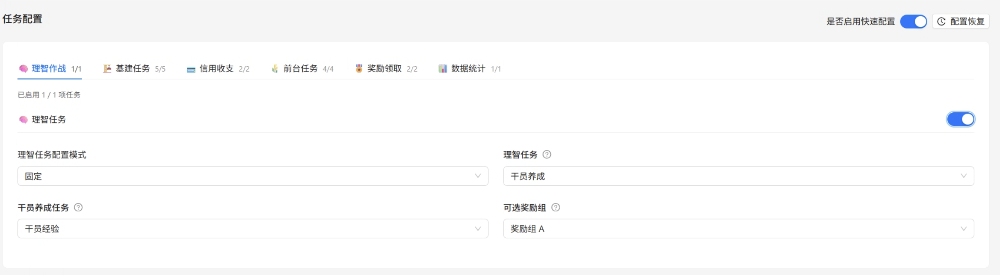
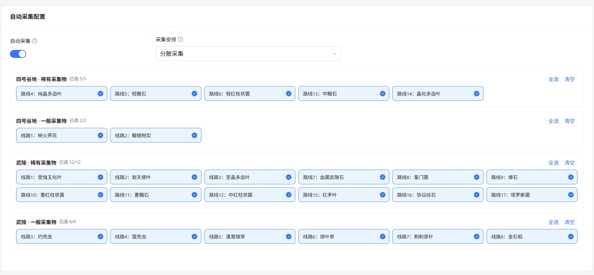
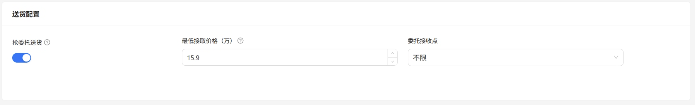

# MaaEnd 配置方法

> 📌 本篇以 **AUTO-MAS-Lite v5.5.0-beta.6 + MaaEnd v2.29.0** 为例，配图为对应版本的界面截图。

## TL;DR(太长不看)

下载 MaaEnd，AUTO-MAS 里二选一：**MaaEnd 专项托管**（推荐，配置简单）或 **MFW 通用项目托管**（任务队列直接编辑），配好账号加入队列，开始托管！

## 什么是 MaaEnd？

MaaEnd 是一个「明日方舟：终末地」第三方自动化工具，基于视觉 AI 技术，能够自动完成协议空间等日常重复性任务。

**详情信息请查阅**：

<Box :items="[
{ name: 'MaaEnd 官网', link: 'https://maaend.com/', image: '/icons/maaend.ico', },
{ name: 'MaaEnd GitHub', link: 'https://github.com/MaaEnd/MaaEnd', image: { light: '/icons/github.svg', dark: '/icons/github-dark.svg', }, },]"/>

## 安装 MaaEnd

1. 前往 <Pill name="MaaEnd 官网" image="/icons/maaend.ico" link="https://maaend.com/"/> 或 <Pill name="MaaEnd 仓库" :image="{ light: '/icons/github.svg', dark: '/icons/github-dark.svg', }" link="https://github.com/MaaEnd/MaaEnd/releases/latest"/> 下载软件压缩包。
2. 将 MaaEnd 压缩包解压至任意文件夹。

::: warning 有两个位置不可以：

- **别放在中文路径下**，容易引发莫名其妙的报错。用 `D:\MaaEnd` 这样的纯英文路径。
- **别放在 AUTO-MAS 根目录里面**。和其他脚本一样，放在里面有被误删的风险。
:::

## 配置脚本

::: warning
   以下配置项内容，仅适用于v5.5.0+, 旧版本信息可能有所变动，以实际情况为准
:::

### 部署方式怎么选

MaaEnd 在 AUTO-MAS 里有两种接入方式，**二选一**即可：

| | 方式一：MaaEnd 专项托管 | 方式二：MFW 通用项目托管 |
| --- | --- | --- |
| 新建托管时的类型 | **MaaEnd 托管** | **MFW 托管** |
| 接入原理 | AUTO-MAS 对 MaaEnd 做专项适配 | 读取 `interface.json`，按通用 MaaFramework 项目接入 |
| 任务配置 | 用户页**快速配置**：自动采集 / 送货 / 理智任务等覆写开关 | **任务队列**直接编辑：从 interface 识别的全部任务可排序、改参数 |
| MaaEnd 原生界面 | 配置 MaaEnd 时会唤起，用于核对 | 非必需，全部在 AUTO-MAS 内配置 |
| 适合谁 | 只跑终末地、想省事的绝大多数用户 | 需要更细的任务队列控制，或想接入其他 MaaFramework 项目 |

两种方式的调度队列用法完全一致。下面先讲 **方式一**（推荐），需要更细控制的再看 **方式二**。

### 方式一：MaaEnd 专项托管

1. 进入 **托管管理**，单击 **新建托管** 并选择 **MaaEnd 托管**

2. 在 **打开的脚本配置** 中的 **MaaEnd 路径** 单击 **选择文件夹**，打开 MaaEnd 软件所在目录。

根据需要调整以下配置：

   | 配置项 | 内容 |
   | --- | --- |
   | **控制器类型** | 用 PC 端还是模拟器。**推荐 PC 端**。这里选的会覆盖你在 MaaEnd 里的设置 |
   | **（PC端）游戏路径** | 选 `Endfield.exe`，**不是**鹰角启动器 |
   | **（PC端）启动时设置分辨率** | 启用后，会在运行MaaEnd时将分辨率设为720P，避免不符合分辨率要求 |
   | **（PC端）结束时恢复分辨率** | 启用后，会在全部任务结束时恢复到设定的分辨率，全屏或指定的分辨率 |
   | **（PC端）游戏启动参数** | 无需要则留空 |
   | **（PC端）游戏启动后等待时间** | 无需填写，已由MaaEnd接管 |
   | **任务完成后关闭游戏** | 账号跑完后要不要自动关掉游戏 |
   | **代理超时限制** | 日志多少分钟没动静就算卡死，默认 10 分钟 |
   | **每日代理次数限制** | 每个账号每天最多代理几次，0 是不限制 |
   | **单次最大重试次数** | 失败后最多重试几次，默认 3 次 |
   | **任务切换方式** | MaaEnd任务分为送货-日常-采集三个阶段，可选择仅重启MaaEnd或重启游戏 |

1. 点击 **保存配置**。

::: warning 首次运行 MaaEnd.exe 的 SmartScreen
首次运行 MaaEnd 时 Windows 可能弹出「Windows 已保护你的电脑」，单击 **更多信息 → 仍要运行** 放行即可。
:::

::: warning 要用模拟器？先确认版本
控制器类型选模拟器（ADB）时有两个前提：

- 先去 **模拟器管理** 把模拟器配好，否则连不上。
- **MaaEnd 必须是 v5.4.0 以上**。上游 MFW 改了命名规则，旧版本收不到 AUTO-MAS 传过去的模拟器参数。
:::

## 配置账号（MaaEnd 专项托管）

1. 在 **托管管理** 的脚本表格内，单击 **添加账号** 以添加一个账号。

2. 按照设置卡相关提示填写账号信息。

### 账号配置字段说明

#### 基本信息

| 配置项 | 填什么 |
| --- | --- |
| **账号名称** | 显示名称，自己认得出就行 |
| **启用状态** | 关掉的账号会被跳过 |
| **账号 ID** | 终末地登录手机号。11位或者后4位都可以，留空就不切号 |
| **密码** | 没有作用 |
| **配置文件来源** | `托管级（共享配置）` 一个托管下所有账号共用一份 MaaEnd 配置；`账号级（独立配置）` 这个账号单独一份；`原生配置`直接使用MaaEnd的配置文件 |
| **剩余天数** | 还能代理几天。`-1` 是不限制，跑成功一次减一天，减到 0 就跳过这个账号 |
| **备注** | 随便写 |

#### 任务配置

右侧开关不启用时，直接使用您设定的MaaEnd配置，MAS不做任何修改；启用后，为您提供MAS额外增强的MaaEnd功能
**涉及的所有覆写常规配置，都需要您的maaend配置内有对应任务**。例如，如您的配置内没有`自动采集`而启用了MAS的自动采集功能，MAS会跳过阶段并提示您。

配置恢复功能可见通用的配置恢复。
AUTO-MAS 会按你的设定去开关 MaaEnd 里的任务。**你的 MaaEnd 里没有的任务会被直接跳过**，不会报错。

##### 自动采集选项

启用后，会额外添加一个位于日常任务之后的自动采集阶段。

- `分散采集`: 每天采集一部分，3天轮换
- `集中采集`: 每3天采集全部启用的路线

##### 送货配置

启用后会在日常任务之前添加送货阶段，注意如需要全自动送货，需要您在MaaEnd内手动配置。

##### 理智任务选项

只有启用了理智任务时才会出现，让你不用打开 MaaEnd 就能改理智任务的设置。

::: tip 切号任务不需要自己添加
 AUTO-MAS 会自动帮你加切号任务，不用你自己去 MaaEnd 里添加。
:::
### 每天仅一次的任务
顾名思义，添加后每天只会执行一次。
### 任务前后额外脚本
与通用脚本一致的功能，支持在任务完成前/后额外执行您指定的程序或脚本。
## 方式二：MFW 通用项目托管

### MFW 项目引导（四步）

新建 MFW 托管后会进入 **MFW 项目引导**，四步完成接入：

**① 基本信息**：选择 MaaEnd 所在目录并单击 **读取 interface**，AUTO-MAS 自动识别任务 / 预设 / 控制器数量，并安装 MaaFW Runner 依赖。
**② 控制配置**：控制方式选 **电脑端·前台 · Win32**，游戏资源选 **通用资源**；PC 游戏启动方式选 **让 MAS 启动游戏**，**游戏可执行文件** 选 `Endfield.exe`（不是鹰角启动器），等待时间默认 60 秒，结束后自动关闭启动进程。
**③ 项目更新**：自动更新时机（运行前 / 运行后）、更新源（GitHub 或 Mirror 酱 + CDK）、更新通道（稳定版）；也可单击 **检查更新** 手动更新。
**④ 运行配置**：确认后结束向导，进入脚本配置页。

### MFW 用户配置

MFW 方式的账号配置与专项托管类似（账号名称 / 启用状态 / 剩余天数 / 备注），区别在于 **任务队列配置**——从 interface 识别出的全部任务直接在 AUTO-MAS 内编辑：

- 左侧**任务队列**：任务可上下调整顺序、添加任务、套用预设模板；
- 右侧**任务配置**面板：选中任务后显示其全部配置项（如「游戏设置」的区服 / 游戏语言 / 显示模式）。

**自动切换账号**任务支持 **账号匹配方式**（手机号后四位 / 国际服邮箱），填入目标账号后四位即可自动切号：

**自动采集**（分散采集 / 集中采集与路线选择）、**优先售卖**（按优先级 1–6 配置）、**物品保留规则**等也全部内联，无需打开 MaaEnd 原生界面。

::: info 与方式一的区别
MFW 方式把任务队列 / 自动采集 / 优先售卖等全部内联到 AUTO-MAS 编辑，MaaEnd 原生 GUI 非必需；
专项托管则保留了 MaaEnd 原生界面的核对环节，并额外提供快速配置覆写。日常使用二选一即可。
:::

## 终末地首次登录

首次部署需要手动启动一次终末地：在 **扫码登录** 界面用手机端鹰角网络 App 扫码，等待资源更新并完成新手引导，能自由行动即可。这一步只需做一次，之后交给托管自动执行。

## 森空岛自动签到

已经搬到 [游戏社区](/docs/advanced-features/community)

## 额外的结果推送

这两项打开后，通知里会多给你一份结果：

- 开了**基质刷取的任务后机制筛选** → 多推一份基质刷取结果。
- 加了**抽数计算** → 多推一份抽数计算结果。

## 常见问题

### 代理跑一半失败了

先看是不是这几种情况：

- **代理时你在用电脑**。前台模式会完全占用鼠标，你这时候动键鼠就会打断它。想边用电脑边代理，得改用模拟器。
- **开了插帧之类的画面增强**。这会让 MaaEnd 截图失败，关掉。

### 分辨率要怎么设

MaaEnd 强制要求 **16:9** 比例。注意全屏模式下的实际分辨率由你的**显示器设置**决定，在游戏里改分辨率没有意义。不想折腾的话，脚本设置里打开启动结束修改分辨率两个选项。

### 游戏路径选哪个 exe

选 `Endfield.exe`，**不要选鹰角启动器**。这是最常见的填错。

## 放进调度队列

托管和账号都配好之后，把账号拖进 [调度队列](/docs/task-scheduler) 就能定时自动跑。多个账号按顺序排队，一个跑完自动切下一个。

需要开机就跑、或者跳过锁屏密码的话，看 [让电脑定时上班](/docs/advanced-features/skip-password)。

## 常见问题补充

### 提示任务被跳过

MAS 的增强功能是对你 MaaEnd 配置里已有的任务做开关，**不会凭空添加**。比如启用了自动采集，但你的 MaaEnd 配置里没有对应任务，MAS 就跳过这个阶段并给出提示。先在 MaaEnd 里把任务配上再回来开开关。

### 剩余天数减到 0 了

账号被跳过是正常行为。把 **剩余天数** 改成 `-1`（不限制）或重新填一个正数就能继续跑。

### 想和其他脚本一起排班

调度队列是按账号排队、跨脚本混排的。把 MaaEnd 的账号和 MAA、通用脚本的账号放进同一个队列即可，不需要分开建队列。
