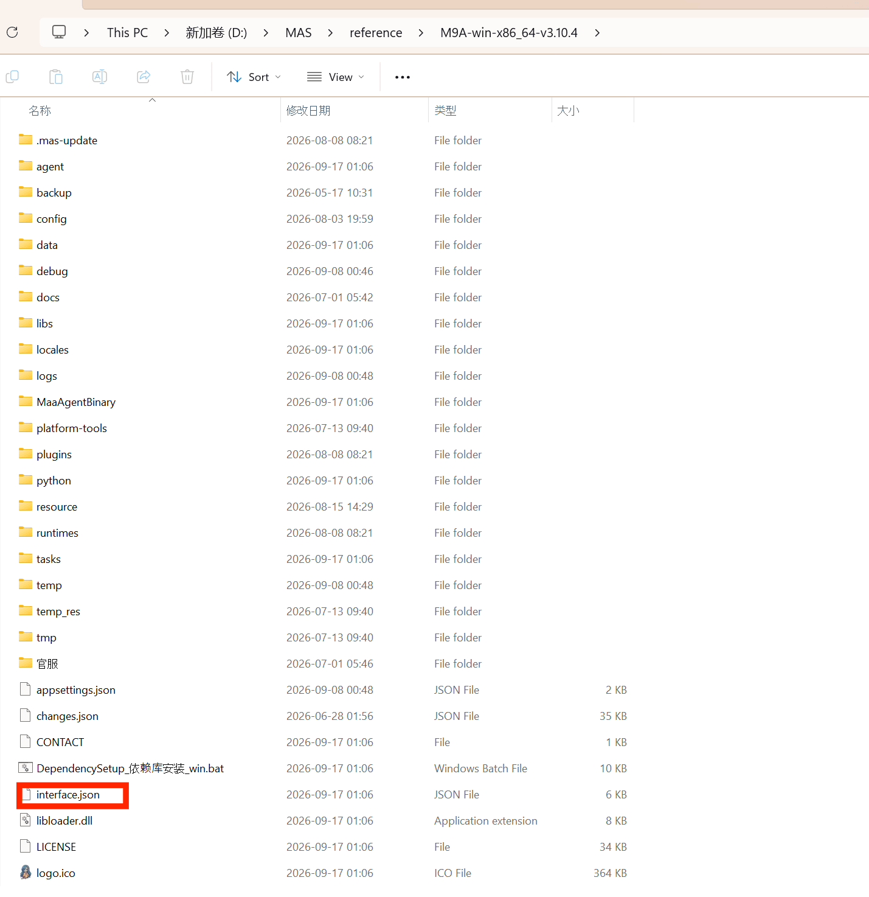
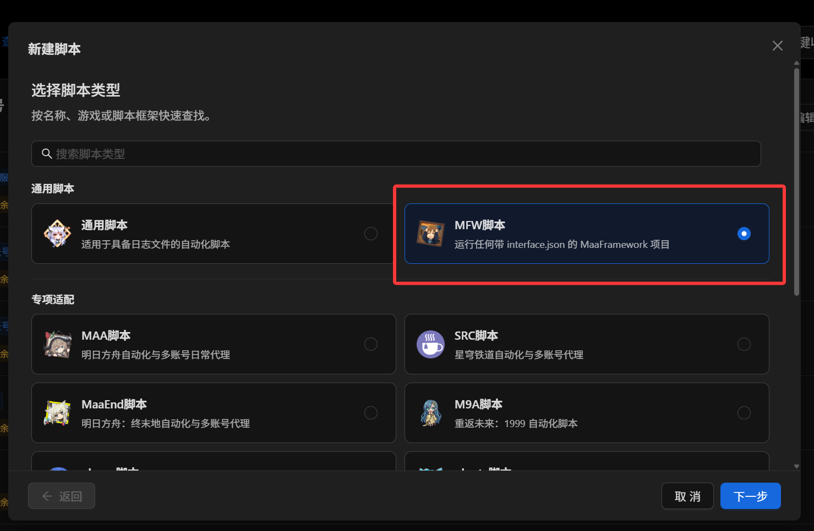
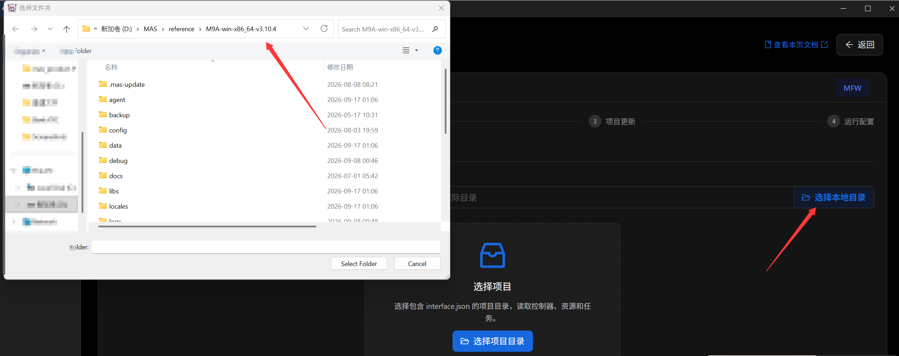
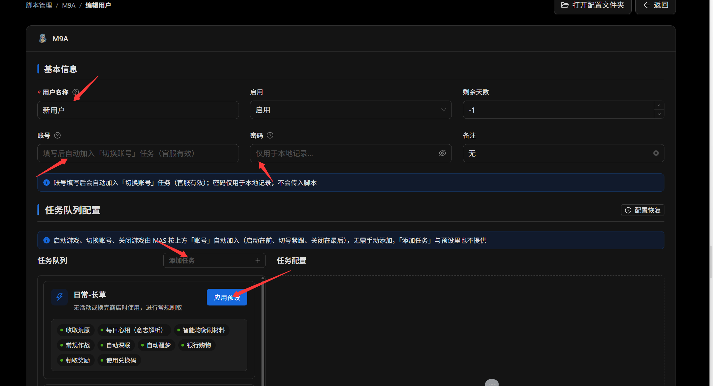

# MFW 项目配置方法

::: tip 提示
带有 `interface.json` 的 [MaaFramework](https://github.com/MaaXYZ/MaaFramework) 项目，可以尝试用 **MFW 脚本**接入 AUTO-MAS。项目自己的界面可以是 MFAAvalonia、MXU、MFW-PyQt6 或 MaaPiCli；AUTO-MAS 运行时不启动这层界面。[M9A](/docs/script-guide/m9a) 等项目会在导入后自动识别为对应的风味类型。
:::

## 什么是 MFW 脚本

MaaFramework 生态里的项目都长一个样：一份 `interface.json` 声明控制器、资源和任务，一个 `resource/` 目录放识别用的图片与流程，有的还带一个 Agent（Python 脚本或可执行文件）处理复杂逻辑，外面再套一层界面程序。

AUTO-MAS 的 MFW 脚本直接读 `interface.json`，使用项目资源与可用的运行环境，按你排好的任务队列运行。它提供通用接入方式；能否顺利运行，还取决于项目的发行包、控制器和 Agent 是否适合当前电脑。

比如 MaaEnd、识宝、M9A、MPA 等，都是 MFW 生态里的项目。下图还能找到更多例子。

因为 M9A 过于权威，因此下面用它走一遍配置流程。页面会随开发调整，具体以你使用的版本为准。

## 配置项目

### 下载并解压

1. 从项目自己的发布页下载与你的系统架构匹配的 **Windows 发行包**（99% 均为 Windows x64）。项目提供 Mirror 酱时，也可以使用其镜像下载。
2. 解压到任意文件夹。准备选进 AUTO-MAS 的那一级目录，应当直接包含 `interface.json`，而不是再套一层文件夹。

以 M9A 为例，在项目目录里看到 `interface.json` 就找对了：

::: warning 注意
通常不需要先打开项目自己的界面；已经打开过也没有问题。
:::

### 在 AUTO-MAS 中导入

接下来在 MAS 内进行配置，依旧以 M9A 为例：

1. 进入 **脚本管理**，单击 **新建脚本**，选择 **MFW 脚本**。这里选通用 MFW 是为了演示自动识别；直接选择 **M9A 脚本**也对。

   

2. 选择项目来源：第一次使用这个项目就选 **新建一个别的项目**；之前导入过，则可以在下面复用。复用时沿用已管理的项目文件，更节约空间，用户和运行设置仍是新脚本自己的。

   

3. 新建项目时，在 **项目目录** 处单击 **选择本地目录**，选中刚才那个包含 `interface.json` 的目录。

   

   目录选到含有 `interface.json` 的这一级：

   

4. 等待导入完成，再检查项目概览和 **运行环境** 面板。首次准备可能需要几分钟：先扫描项目文件，再复制运行需要的内容。

   **扫描项目目录：**

   

   **复制项目文件：**

   

因为导入的是 M9A，脚本会自动识别成 M9A 类型；其他未被风味专项认领的项目会继续显示为通用 MFW。页面随后显示的是 MAS 内部的项目目录，运行也从这里读取项目文件。

**所以你可以同时运行 MAS 里的 M9A 和原来的 M9A；确认导入成功、试跑正常后，也可以删掉原目录节约空间。**需要重新导入或重建副本时，仍要有来源目录。

### 控制方式、更新与运行配置

按引导选择控制方式、游戏资源，以及模拟器或 PC 游戏启动方式。项目不支持的控制方式不要选。下面两张图分别是 ADB 和 Win32 的配置示例：

**ADB 与模拟器：**

**Win32 与 PC 游戏：**

PS：**尝试修改 Unity 类游戏分辨率**会在 MAS 启动游戏前临时修改游戏的注册表设置，结束后还原。提供了两种常用分辨率；分辨率较低时，对电脑性能的要求也较低。

项目更新这一步可选择是否自动更新、更新源和更新通道。众所周知的原因，GitHub 更新速度可能较慢；若设为运行前自动更新，就要给下载留足时间。大项目如 MaaFGO，解压和盘点也会花些时间，请耐心等待，有问题及时反馈。

最后看一下运行配置。这里的**单次运行时间限制是硬超时**：MFW 项目直接运行在 MAS 上，运行异常时 MAS 能感知到；硬超时用于防止任务一直循环。

项目原来的界面里已有配置时，可以勾选导入；每份选中的配置会转成一个用户。也可以不导入，直接创建第一个用户。

**导入已有配置：**

**从空用户开始：**

### 配置第一个用户

让我们创建第一个用户！之后如有需要，也可以从脚本列表继续添加。建议先排一个简单任务试跑，确认环境正常后再添加其他任务。

用户名可以自己定义。注意：同名用户的历史记录会归为一类，建议用“柒音（M9A）”“柒音（MaaEnd）”这类名称区分不同脚本。

以 M9A 为例，风味专项会比通用 MFW 多一些适配：在官服资源下填写 **账号**，运行时会自动加入“切换账号”任务；其他资源不一定支持。**密码仅供本地记录，不会传给脚本。**

任务可以逐个添加，也可以应用项目资源里的预设模板快速填入。接下来逐项调整任务选项即可，修改会实时保存。

有些项目还会在任务说明中附图：

任务说明里的图片支持点击放大：

::: tip 彩蛋
我们还藏了一些彩蛋，比如识宝导入后的脚本名称和 tag～

至于头像和卫星，下次一定.jpg
:::

### 内嵌副本

MFW 脚本在 AUTO-MAS 管理的副本上运行；你选择的目录是**导入来源**。导入会把运行所需的项目内容放入 AUTO-MAS 的数据目录，项目自己的界面程序通常不在运行副本中。之后的运行和项目更新针对副本，AUTO-MAS 不会修改来源目录。

导入成功且副本健康后，来源目录不在也能继续运行和更新。**重新导入、或在副本缺失时重建**仍需要来源目录；因此先确认脚本能正常试跑，再决定是否保留原目录。想继续使用项目自己的界面，也应保留原目录。

项目目录下面的 **内嵌副本** 面板显示副本的状态：

| 状态行 | 含义 |
| --- | --- |
| 副本完整 / 副本缺失 | 副本是否可用。缺失时，运行前会尝试从来源目录重建；来源也不存在时需要重新指定目录 |
| 副本只有来源的 xx%（A → B） | 来源目录与运行副本的大小对比；它不是剩余下载进度 |
| 外壳：MXU / MFAAvalonia … | 识别出的界面程序类型，下载更新包时按它选对应的安装包 |
| MaaFramework x.y.z（项目自带，原样带入副本） | 项目自带的运行时版本，副本里用的就是这一份 |
| Agent Python x.y（项目自带，原样带入副本） | 项目自带了 Python 解释器时才显示 |
| 导入自来源 vX | 导入那一刻来源目录的版本；副本之后自己更新过就会比它新，这是正常的 |
| 来源目录已不存在 | 你把原目录删了。副本照常运行，只是不能再重新导入 |

- **重新导入**：按当前来源目录重新生成运行副本。你手动更新了原目录、或者怀疑副本不对劲时用它；同项目同更新通道的其他脚本也可能跟随新版本。
- **换目录**：再点一次 **选择本地目录** 选一个新目录，等于换来源并重新导入；导入失败时旧副本和旧来源都原样不动。换成另一个项目的目录也可以，脚本会跟着变成那个项目（M9A 目录会自动变成 M9A 脚本，反过来也一样）；用户和运行设置保留，任务队列要按新项目重排。
- **删脚本**：该脚本的运行副本会随脚本移除，来源目录不动。删除前先确认是否还需要其中的运行期数据。

::: tip 多个脚本与旧配置
- 同一项目可创建多个脚本，各自拥有独立的运行视图和用户配置。相同版本的项目文件可以共用存储；**同一项目、同一更新通道**的脚本会跟随同一项目版本，不能把它们当成彼此独立的版本副本。
- 旧 MFW 脚本首次使用新版本时会尝试导入原目录。请在升级后检查一次副本状态并试跑。
:::

### 控制方式与游戏资源

| 配置项 | 说明 |
| --- | --- |
| 控制方式 | 从 `interface.json` 声明的控制器里选：安卓（ADB）还是 PC 窗口（Win32） |
| 游戏资源 | 从 `interface.json` 声明的资源里选，一般对应服务器（官服 / B 服 / 国际服…）。留空时自动选匹配当前控制方式的第一个 |
| 模拟器 / 模拟器实例 | 控制方式是 ADB 时必填，先在 **模拟器管理** 里配好模拟器 |
| 游戏包名 | 控制方式是 ADB 时使用。选定资源后 AUTO-MAS 会从项目里自动推断并填好，推不出来就留空 |
| PC 游戏启动方式 | 控制方式是 Win32 时出现：**让 MAS 启动游戏**（填游戏本体的 exe，结束后由 MAS 关闭）或 **使用其他方式启停游戏**（由脚本或你自己启停，MAS 只接管已运行的窗口） |
| 启动后再等（秒） | 只在由 MAS 启动游戏时生效：窗口出现后再等这么久才下发第一个任务，给游戏加载画面留时间 |
| 尝试修改 Unity 类游戏分辨率 | 只对 Unity 引擎的游戏有效：MAS 启动游戏前把它临时改成所选尺寸的窗口模式，游戏关闭后恢复原值；游戏已经在运行时不改 |

### 运行配置

| 配置项 | 说明 | 默认值 |
| --- | --- | --- |
| 用户单日代理次数上限 | 单个用户每天最多代理几次，0 是不限制 | 0 |
| 代理重试次数限制 | 任务失败后最多重试几次 | 3 |
| 单次运行时间限制（分钟） | 单个用户一次运行最多跑几分钟，超时强制结束 | 120 |
| 每日 / 每周 / 每月完成后跳过 | 选中的任务在当天 / 本周 / 本月成功过一次之后，后续运行自动跳过 | 不选 |

### 项目更新

| 配置项 | 说明 | 默认值 |
| --- | --- | --- |
| 更新源 | **GitHub**：无需配置，直接从项目的 GitHub Release 下载；**Mirror 酱**：需要 CDK，下载快且校验 sha256 | GitHub |
| 更新通道 | 稳定版 / 测试版，以项目实际发布的为准 | 稳定版 |
| Mirror 酱 CDK | 默认带入 MAS 更新设置里填过的那份，可以单独改成本脚本专用的 | |
| 自动更新 | **运行前**：每次运行前检查并更新项目；**运行后**：本次运行结束后更新；**不更新**：只手动更新。更新失败不会阻断任务运行 | 运行前 |

页面上也可以随时 **检查更新** 或 **立即更新**，下方的 **更新过程** 面板会实时显示下载、覆盖、校验的进度和日志。有可靠更新基线时走增量包，否则下全量包。更新只写副本，来源目录不动；脚本正在运行时不能更新，等它跑完。

## 用户与任务配置速查

之后要增加用户，可在 **脚本管理** 的脚本表格内单击 **添加用户**。AUTO-MAS 会按用户列表顺序执行各自的任务队列。通用 MFW 的账号栏通常只作本地记录；风味专项可能赋予它具体用途，例如 M9A 官服的自动切号。密码仅作本地记录。

### 任务队列

- 任务列表就是这个项目 `interface.json` 里声明的任务，选中一个加入队列，再拖动调整顺序。
- 项目自带 **预设模板** 时（比如"日常"），点一下就能批量加入一组任务。
- 每个任务的 **任务配置** 对应项目自己界面上的那些选项（服务器、关卡、次数……），默认值与项目一致。
- 通用 MFW 按选中的队列运行；风味专项可能在运行前自动补充或调整任务。例如 M9A 会管理启动、切号和关闭游戏，具体以对应项目页面的提示为准。

## 每次运行发生了什么

1. 副本不在（或来源目录换过）就先从来源导入一次。
2. 按 **自动更新** 的设置检查并更新副本。
3. 确认运行环境：MaaFramework 运行时、Agent 环境还在不在、有没有随项目更新而变化。
4. 启动模拟器或游戏，连接控制器，加载资源，拉起 Agent。
5. 按队列逐个执行任务；失败按 **代理重试次数限制** 重试。
6. 结束后关闭由 MAS 启动的模拟器 / 游戏，写入历史记录并推送通知。

## 你的项目目录会被改坏吗

不会。运行、更新、日志、这次要跑的配置全部落在副本里，来源目录只在导入 / 重新导入时被**读**一次。副本里 `interface.json` 和 `config/` 每次运行前会归档一份，用户页的 **配置恢复** 里可以随时预览、恢复。

## 常见问题

**运行环境面板一直红，提示准备失败**

部分项目首次运行需要下载 MaaFramework 或 Agent 依赖，检查网络或代理后点 **重试**（同一个按钮，失败时会变成重试）。项目目录选错（里面没有 `interface.json`）也会停在这里。

**任务没跑就结束了，运行页提示"检查未通过"**

最常见的是所选 **游戏资源** 不支持当前 **控制方式**（比如键鼠专用的资源配了安卓控制器），换一个资源；或者控制方式是 ADB 但没选模拟器实例。

**第一次运行提示 Agent 进程已退出 / 连接超时**

先看运行日志和 **运行环境** 面板，确认项目要求的 Agent 依赖是否已准备好。不同项目的安装方式不同；需要在项目原生界面完成初始化的，请按项目说明操作，再重新导入。

**导入自来源 v3.10，概览表却显示 v3.16**

前者是导入时来源目录的版本，后者是副本当前的版本——副本自己更新过了。想让来源目录也跟上，去更新原目录再点 **重新导入**（不更新也不影响运行）。

**我把原目录删了**

没问题。副本照常运行、照常更新，只是不能再 **重新导入**，状态行会提示"来源目录已不存在"。副本也丢了的话重新下载一份项目，再 **选择本地目录** 指过去。

**想看副本在哪**

AUTO-MAS 安装目录下的 `data/mfw/<脚本 ID 前 12 位>/`。这里有脚本运行期间产生的数据，请不要手动编辑或删除；副本异常时先查看页面状态与日志，并使用页面提供的重新导入入口。

**升级后 MFW 脚本第一次运行多等了十几秒**

那可能是在从原目录导入副本。完成并试跑后，日常运行一般不再读取原目录；重新导入或副本缺失后的重建仍需要它。

## 给开发者

如果项目需要自己的脚本类型、提示或运行前任务编排，请看 [风味专项开发](/developer/maafw-flavor)。
