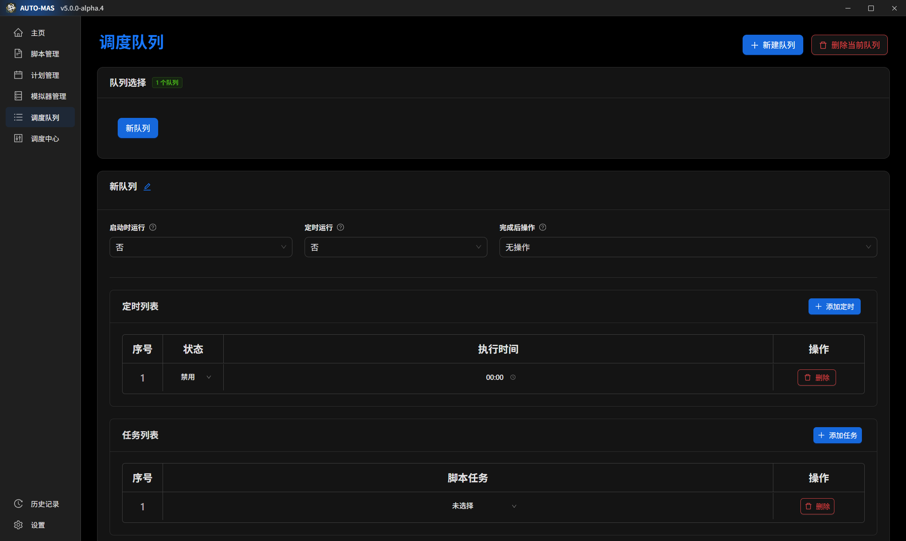

# 调度队列

调度队列是AUTO-MAS“多账号”“全自动”的关键核心组件。

它能设定**多个脚本**的运行模式，启动软件时自动运行、定时自动运行。

::: warning 温馨提醒
调度队列功能为脚本串联运行，及完成一个脚本后才会运行下一个脚本，如果出现单个队列脚本并联运行的时候请检查通用脚本设置

同一队列的时间设置不同启动时间并不是和脚本一一对应的启动时间，运行队列会同时运行该队列的所有脚本

如果确定要使用，请仔细并认真阅读本文档后再进行提问。
:::

## 用法

1. 点击右上角的新建队列，创造一个新队列
2. 根据你的需求，选择 启动时运行 或 定时运行 

::: tip 小技巧

你可以将MAS设为开机启动项，并在调度队列勾选启动时运行，这样在你启动电脑时可以无感代理模拟器的脚本（如MAA）

如果你有一台永不停歇的核动力电脑，你可以设定定时运行，MAS会在你选择的时间进行自动代理

如果你有特殊的上号需求（例如MAA自定义基建），你可以在MAA的自定义基建生效前一段时间自动启动MAA，让MAA执行基建切换

:::

3. 点击添加定时，设定你需要运行脚本的时间，**别忘了将状态改为启用**
4. 添加任务，此处的**任务**为 **脚本管理** 内已经配置好的脚本任务，若没有可选的任务，请查阅[脚本配置](../../docsV5/script-guide/__index)

