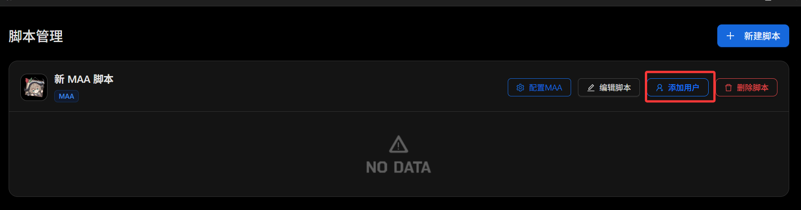
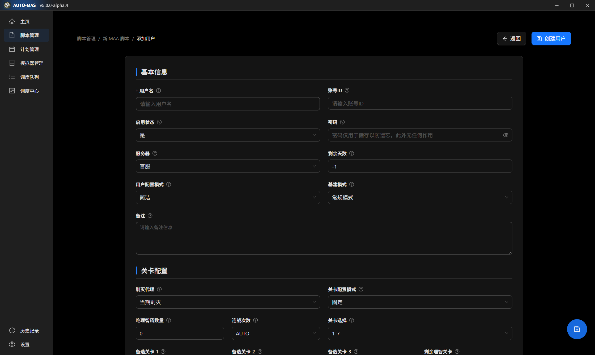

# 三月七小助手用户指南

## 在AUTO中调度三月七

### 什么是 三月七小助手？

三月七小助手是一个崩坏星穹铁道的第三方软件，能够轻松完成崩坏星穹铁道日常代理、差分宇宙等重复性无趣工作。

**详情信息请查阅**：

<Box :items="[
{ name: '三月七小助手 官网', link: 'https://m7a.top/#/', image: 'https://m7a.top/assets/screenshot/March7th.png', },
{ name: '三月七小助手 GitHub', link: 'https://github.com/moesnow/March7thAssistant', image: { light: '/resource/github.svg', dark: '/resource/github-dark.svg', }, },]"/>

## 

### 安装 三月七

1. 前往 <Pill name="三月七小助手 官网" image="https://m7a.top/assets/screenshot/March7th.png" link="https://m7a.top/#/"/>、<Pill name="三月七小助手 仓库" :image="{ light: '/resource/github.svg', dark: '/resource/github-dark.svg', }" link="https://github.com/moesnow/March7thAssistant/releases/"/> 或 <Pill name="Mirror 酱" image="https://mirrorchyan.com/favicon.ico" link="https://mirrorchyan.com/zh/projects?scouce=AUTO_MAA-Web&rid=March7thAssistant&channel=stable"/> 下载软件压缩包。
2. 将 三月七小助手 压缩包解压至任意文件夹。

::: warning 温馨提醒
请不要将三月七小助手以及其他需要使用的通用脚本解压在中文文件夹，比如**脚本**等等。

以便出现不必要的异常。
:::

### 设置脚本实例

1. 打开 `March7th Launcher.exe`，阅读并关闭三月七小助手的默认公告。

2. 关闭 **三月七小助手**，打开**AUTO-MAS**，进入 **脚本管理**，单击 **新建脚本** 并选择 **通用脚本** 以添加脚本实例管理页面。

3. 在弹出的窗口里选择选择**从模板创建**，然后单击**确定**

4. 接着在新的窗口界面找到并选择**三月七小助手的通用模板参考**，并点击**使用此模板**。

稍后会打开脚本的配置，如下图：

5. 在 **打开的脚本配置** 中的 **脚本根目录** 单击 **选择文件夹**，打开 三月七小助手 软件所在目录。

::: warning 温馨提示
脚本配置一栏会在选择脚本根目录以后自动修正，请不要在不理解这个功能有什么作用的时候贸然修改，以便给自己在使用AUTO-MAS的过程中带来不愉快。
:::

6. 在**模拟器管理**中选择模拟器和模拟器实例

  如果此处没有模拟器，请先完成[模拟器管理](/docsV5/advanced-features/emulator-manager.md)

  完成后，点击**右下角蓝色保存按钮**保存。

6. 点击此处在MAA中配置

7. 参照 [多开指南 > MAA 设置](/docsV5/advanced-features/multi-instance.md) 完成 **MAA** 的 **启动设置**，并手动取消勾选 **开机自启动MAA**。

  同时根据你的偏好，你可以设置各种比如：

  公招是否自动点五星，是否启用GPU加速，明日方舟的服务器，启动设置中的“等待模拟器启动时间”（此选项会决定AUTO等待模拟器的启动时间）等

8. 完成配置后，关闭 **MAA**。并在AUTO中点击保存配置。

### 设置用户配置

1. 在 **脚本管理** 的脚本表格内，单击 **添加用户** 以添加一个用户。

2. 按照设置卡相关提示填写用户信息。

::: info 注意
开启 **自定义基建** 后需要 **选择配置文件**；**详细** 配置模式下开启 **剿灭任务**、**日常任务** 后需要 **设置具体配置**。

用户名：该用户在脚本的名字，无实际作用，仅用作展示用户和日志分类

账号id：游戏的**绑定手机号（官服）**或**昵称（B服）**

密码：无实际作用，仅用作防止遗忘。该密码会在本地DPAPI加密保存，基于TPM，移动AUTO文件夹至其他电脑或刷机，均会导致密码无法解密和失效，具有强安全性，可根据自己实际情况使用。

其余配置请查看软件内tips。

:::
::: tip 提示

由于 MAA 在 **B服账号切换** 功能中使用的 OCR（文字识别）技术准确率有限，我们建议如下填写方式以提高识别和切换成功率：

### 通用建议

- MAA 的账号切换功能只需**成功识别一个唯一片段**即可完成切换。
- 请填写**仅该账号独有的部分片段**，避免与其他账号重复。
- 建议在 MAA 中测试填写片段能否正常切换账号，确认无误后再填写至 AUTO_MAS。
- 若同区服仅有一个账号，也可将 `账号ID` 留空。

#### 官服

- 官服账号ID为手机号，通常只需填写**后四位数字**即可，无需填写完整手机号。~~（你也不想无意中泄露自己的手机号吧~）~~ 
- 示例：
  - 账号1：`133XXXX1234`
  - 账号2：`133XXXX5678`
  - 若要切换账号1，可填写 `2`、`4`、`12`、`34`、`123`、`234`、`1234` 等仅账号1拥有的片段。

#### B服

- B服账号为 B站昵称，可能包含**中文、英文、数字、特殊符号、日文**等复杂字符，OCR 模型识别准确率偏低。因此，**不建议填写完整昵称**，建议填写 **不易识别错误的、唯一片段**，避免：
  - 生僻字（如：`黍`，可能被识别为其他文字）
  - 下划线 `_`（常被识别错误或漏识）
- 示例：
  - 账号1：`DLmaster_361` → 可填写 `master`、`361`
  - 账号2：`黍的XX_1234` → 可填写 `1234`、`的`、`XX`，**不建议填写“黍”或下划线**
  

经过这些修改，你应该能够稳定的进行账号切换

:::

至此，你的MAA已经配置完成。

你可以：[创造调度队列，设置定时任务](/docsV5/advanced-features/scheduler)

现在立刻马上就要切换账号的功能？你可以试试[StarRailAutoLogin: 一个在AUTO-MAS项目中使用的崩坏：星穹铁道自动登录脚本](https://github.com/Alirea10/StarRailAutoLogin)