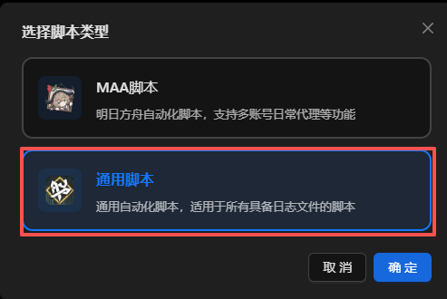
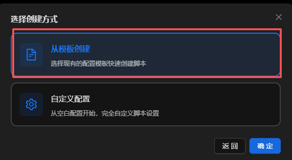

# 三月七小助手用户指南

## 在AUTO中调度三月七

### 什么是 三月七小助手？

三月七小助手是一个崩坏星穹铁道的第三方软件，能够轻松完成崩坏星穹铁道日常代理、差分宇宙等重复性无趣工作。

**详情信息请查阅**：

<Box :items="[
{ name: '三月七小助手 官网', link: 'https://m7a.top/#/', image: 'https://m7a.top/assets/screenshot/March7th.png', },
{ name: '三月七小助手 GitHub', link: 'https://github.com/moesnow/March7thAssistant', image: { light: '/resource/github.svg', dark: '/resource/github-dark.svg', }, },]"/>

## 

### 安装 三月七

1. 前往 <Pill name="三月七小助手 官网" image="https://m7a.top/assets/screenshot/March7th.png" link="https://m7a.top/#/"/>、<Pill name="三月七小助手 仓库" :image="{ light: '/resource/github.svg', dark: '/resource/github-dark.svg', }" link="https://github.com/moesnow/March7thAssistant/releases/"/> 或 <Pill name="Mirror 酱" image="https://mirrorchyan.com/favicon.ico" link="https://mirrorchyan.com/zh/projects?scouce=AUTO_MAA-Web&rid=March7thAssistant&channel=stable"/> 下载软件压缩包。
2. 将 三月七小助手 压缩包解压至任意文件夹。

::: warning 温馨提醒
请不要将三月七小助手以及其他需要使用的通用脚本解压在中文文件夹，比如**脚本**等等。

以便出现不必要的异常。
:::

### 设置脚本实例

1. 打开 `March7th Launcher.exe`，阅读并关闭三月七小助手的默认公告。

2. 关闭 **三月七小助手**，打开**AUTO-MAS**，进入 **脚本管理**，单击 **新建脚本** 并选择 **通用脚本** 以添加脚本实例管理页面。

3. 在弹出的窗口里选择选择**从模板创建**，然后单击**确定**

4. 接着在新的窗口界面找到并选择**三月七小助手的通用模板参考**，并点击**使用此模板**。

稍后会打开脚本的配置，如下图：

5. 在 **打开的脚本配置** 中的 **脚本根目录** 单击 **选择文件夹**，打开 三月七小助手 软件所在目录。

::: warning 温馨提示
脚本配置一栏会在选择脚本根目录以后自动修正，请不要在不理解这个功能有什么作用的时候贸然修改，以便给自己在使用AUTO-MAS的过程中带来不愉快。
:::

现在立刻马上就要切换账号的功能？你可以试试[StarRailAutoLogin: 一个在AUTO-MAS项目中使用的崩坏：星穹铁道自动登录脚本](https://github.com/Alirea10/StarRailAutoLogin)

未完待续.....