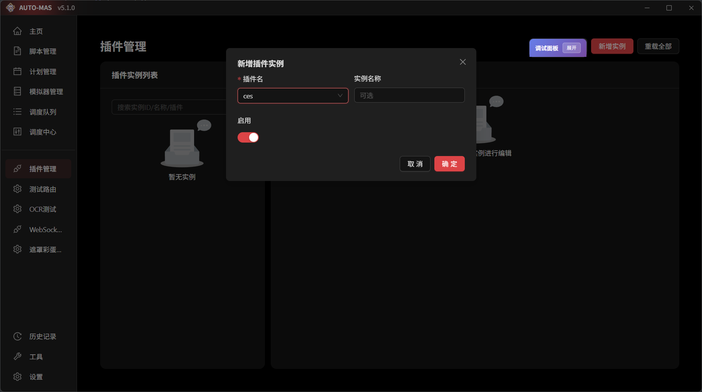

# 插件开发

::: warning

插件系统还在积极开发中，可能会有其他变化

:::

本章节将会带领你按照标准流程开始开发插件。

::: tip 提示

本节中介绍的命令行非专门提醒都需要在应用目录和python虚拟环境下运行

即克隆的AUTO-MAS/ 目录与自行创建的.venv

:::

## 创建新插件

在应用目录下运行以下指令

```bat
python script/plugin_tool.py [--name <name>] [--description <description>] [--init-git <bool>]
```

如果不提供参数，也可以在交互式命令行中填写，无需一次写完。

- **--name:** 插件的包名
- **--description:** 插件的介绍，后续可以更改
- **--init-git:**  是否 git 初始化

我们假设你创建了一个叫ces的插件，那么你将看到如下目录结构。

```diff
AUTO-MAS
└── plugins
    └── ces
        ├── src
        │   └── ces
        │   	├── plugin.py
        │   	├── schema.py
        │   	└── __init__.py
        ├── pyproject.toml
        ├── .editorconfig
        ├── .gitattributes
        ├── .gitignore
        └── README.md

```

打开plugin.py和schema.py，可以看到如下内容

```python
from __future__ import annotations
from typing import TYPE_CHECKING
from .schema import Config
if TYPE_CHECKING:
    from app.core.plugins.context import PluginContext

class Plugin:
    def __init__(self, ctx: "PluginContext") -> None:
        self.ctx = ctx

    async def on_start(self) -> None:
        # 从此处开始
        self.ctx.logger.info("[{}] ".format(self.ctx.plugin_name))
        self.ctx.logger.info(f"hello={self.ctx.config.get('hello')}")
        self.ctx.event.emit_async()

    async def on_stop(self, reason: str) -> None:
        self.ctx.logger.info("[{}] 插件停止, reason={}".format(self.ctx.plugin_name, reason))

```

```python
from pydantic import BaseModel, ConfigDict, Field

class Config(BaseModel):
    model_config = ConfigDict(extra="allow")

    process_name: str = Field(default="Mumu", description="问候词")

```

打开pyproject.toml，应该看到如下内容

```toml
[build-system]
requires = ["setuptools>=68", "wheel"]
build-backend = "setuptools.build_meta"

[project]
name = "automas_plugin_ces"
version = "0.1.0"
description = "meow"
readme = { file = "README.md", content-type = "text/markdown" }
requires-python = ">=3.10"
dependencies = ["pydantic>=2.0"]

[project.entry-points."auto_mas.plugins"]
ces = "ces.plugin:Plugin"

[tool.setuptools.packages.find]
where = ["src"]

```

至于README，则可根据你的需求自行修改。

## 启用插件



来到插件管理，新增实例，选择ces插件，将其启用。观察后端日志，应该能看到如下日志

```bash
| INFO     | 插件加载器 | 插件扫描完成，共发现 1 个插件
| INFO     | 插件:ces:e4fb6 | [ces] 插件启动
| INFO     | 插件:ces:e4fb6 | hello=world
| INFO     | 插件加载器 | 插件实例已激活: ces:e4fb6 (ces)
```

这样插件就加载成功了！

## 添加依赖

::: warning

依赖和隔离仍然处于开发状态，可能仍有重载bug/解释器异常等问题。
当前，所有依赖都会默认安装在MAS所用的解释器中，这意味着使用ctx.runtime的开发者无法在自己的虚拟环境中安装依赖，这是暂时的。
所有使用主程序解释器的插件需要自行维护库依赖的问题，避免和主程序库冲突。

:::

回到pyproject.toml

```toml
[project]
name = "automas_plugin_ces"
version = "0.1.0"
description = "meow"
readme = { file = "README.md", content-type = "text/markdown" }
requires-python = ">=3.10"
dependencies = ["pydantic>=2.0"]   #此处添加依赖
```

添加依赖后，重载插件，后端会自动通过pip下载和管理依赖。

::: warning

如果出现奇怪的问题，不妨先试着重启后端

:::

当你需要更新依赖时，直接修改后重载即可。

## 二次开发

::: warning

如果你想要贡献原始仓库，在开始执行下面的操作之前，请确保你对要开发的仓库有写入权限。

如果没有，你应当先创建属于自己的 fork，然后将下面的仓库名称替换为你的 fork 仓库名称。

举个例子，假如你的 GitHub 用户名是 `ceobe`，你想要开发

:::


当你需要开发其他认开发的插件时，只需要将源码照常克隆到plugin文件夹下即可。

```bash
cd plugins
git clone ......
```

