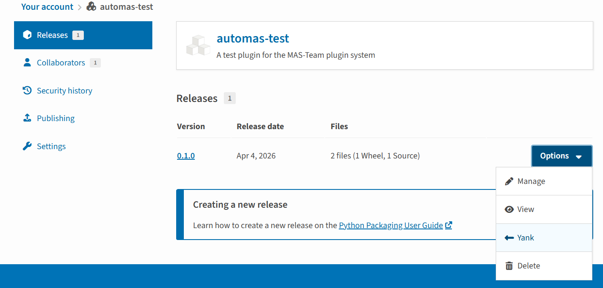

# 发布插件

本文将从头开始教你如何将编写的插件上传到PyPi，供任何用户下载安装使用。

## 构建源代码

如果你需要发布到插件市场，你需要构建你的源代码。为此你需要先安装twine

你可以选择在虚拟环境中安装，也可以在自己的系统环境安装，在你使用IDE工具时，一般会默认使用虚拟环境，我们也推荐你在虚拟环境中安装twine。

```bash
pip install build twine
```

进入你的插件目录，如

```diff
AUTO-MAS/plugins/ces
```

运行

```bash
python -m build
```

它会生成：

```diff
dist/
 ├── ces-0.1.0.tar.gz
 └── ces-0.1.0-py3-none-any.whl
```

## 注册账号
注册 PyPI 和 TestPyPI 账号
   - **正式环境**：访问 [pypi.org](https://pypi.org/) 注册账号。
   - **测试环境**：访问 [test.pypi.org](https://test.pypi.org/) 注册账号。这是一个独立的测试服务器，用来验证你的发布流程，不会影响正式的 PyPI。


## 发布插件
回到你的插件目录，上传你的代码
```bash
twine upload dist/*
```

如果你希望使用test.pypi，可以

```
twine upload --repository testpypi dist/*
```

##  更新插件版本

初始创建的插件版本号为 `1.0.0`。当你修改过插件后，你需要更新版本号才能重新发布。

打开pyproject.toml文件，找到

```
version = "1.0.0"
```

将版本号手动提升。

::: tip 提醒

Pypi要求必须新增版本号才能发布，因此无论如何，只要你更新了代码，你就必须增加版本号

:::

## 标记停用版本

如果你上传了插件到Pypi，事后发现你的插件可能导致错误或严重漏洞，你可以将你的插件标记为yank

1. 登录 PyPI
2. 进入你的项目页面
3. 点击 **“管理（Manage）”**
4. 进入 **“发行版（Releases）”**
5. 找到你要撤回的版本
6. 点击该版本旁边的 **“选项（Option）”**
7. 选择Yank



::: tip 有什么用？

 yanked表示撤回版本

- 针对**某个版本**（不是整个包）
- 表示这个版本**不推荐安装**（比如有严重 bug）
- `pip install`：
  - 默认不会选中 yanked 版本
  - 但如果你**明确指定版本号**，仍然可以安装

使用yank，可以避免不指定版本导致的误安装

:::

::: warning 我能不能删了整个包或版本？

- 你可以删除：
  - 单个 release（版本）
  - 或整个 package
- 但：
  - **不可恢复**
  - 破坏依赖链（所以一般不推荐）

PyPI 官方更鼓励 **不要删，而是标记弃用**

除非遇到严重的供应链攻击或病毒代码，一般来说不建议你直接删了。

:::
